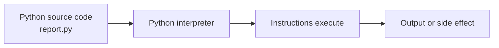

# Introduction to Python

---

## Learning Objectives

Students will learn:

- What Python is, how a program becomes an action, and why Python is widely used.
- How to read and write a small Python program using values, names, and functions.
- Where Python fits in real applications, data work, automation, and AI systems.

---

## Prerequisites

None. You only need a computer and curiosity. Installation and ways to run Python are covered in the next two lessons.

---

## Why This Matters

Software is a set of precise instructions that tells a computer how to transform input into useful output. A delivery service might turn an order into a route, a bank might turn transactions into a balance, and an AI product might turn a question into a helpful response. Python is a language for expressing those instructions.

Python is popular because its code is readable, its standard library contains useful built-in tools, and its ecosystem supports web services, automation, data analysis, machine learning, and testing. The same foundations you use to format a report can later help you prepare training data or call an API.

Python is not a shortcut around thinking. Computers do exactly what the program says, including unintended instructions. Learning to state a problem clearly, inspect results, and correct mistakes is therefore as important as learning syntax.

---

## Theory

A **programming language** is a structured way for humans to give instructions to a computer. Python source code is the text you write in a `.py` file. The Python **interpreter** reads that code and executes it. Unlike a compiled language where you usually build a separate executable first, Python commonly runs source code through its interpreter when you ask it to run a file.

Programs work with **data**: numbers, text, dates, records, and more. An **expression** produces a value, such as `8 * 3`. A **statement** asks Python to do something, such as save a value under a name or display text. A **function** is a named operation; `print()` is a built-in function that writes a value to the screen.

Indentation—spaces at the start of a line—is meaningful in Python. It groups instructions that belong together. This makes Python code visually consistent, but it also means mixed or incorrect indentation can change a program or cause an error.

Python has a large community package ecosystem. A **package** is reusable code installed into an environment. Later lessons will explain how to isolate project packages with virtual environments. For now, prefer Python's built-in features until a package is genuinely needed.

---

## Mental Model

Think of a Python program as a small, reliable workflow. It accepts facts, applies rules, and reports a result. Names are labels attached to values while the program runs. Functions are reusable actions. The interpreter is the worker that follows the workflow from top to bottom.

When debugging, trace that workflow: What value entered? Which rule changed it? What value was produced? This approach scales from a three-line script to a production data pipeline.

---

## Visual Explanation



The source file is your recipe. The interpreter reads it, executes each instruction, and may display output, save a file, or send a request to another system.

---

## Syntax

Python favors readable statements. A name is created with `=`; the value on the right is calculated first and stored under the name on the left. Text is written between quotes. Function arguments go inside parentheses.

```python
customer_name = "Asha"
completed_orders = 12
print(customer_name, "completed", completed_orders, "orders")
```

`customer_name` and `completed_orders` use `snake_case`, the standard Python naming style for variables and functions. The value `12` is an integer, while the quoted words are strings (text).

---

## Code Example 1

Save this as `daily_summary.py`. It creates a small operational summary from real-looking data.

```python
orders_received = 84
orders_shipped = 79
orders_pending = orders_received - orders_shipped

print("Daily fulfillment summary")
print("Orders received:", orders_received)
print("Orders shipped:", orders_shipped)
print("Orders pending:", orders_pending)
```

The program calculates rather than manually types the pending count. That distinction matters: when `orders_received` changes tomorrow, the result remains correct. `print()` accepts several values and puts spaces between them for readable output.

---

## Code Example 2

Functions make a rule reusable. This example turns a temperature from Celsius into Fahrenheit, a task that could occur in a weather dashboard.

```python
def celsius_to_fahrenheit(celsius):
    return celsius * 9 / 5 + 32


morning_celsius = 24
morning_fahrenheit = celsius_to_fahrenheit(morning_celsius)
print("Morning temperature:", morning_fahrenheit, "F")
```

`def` defines a function. `celsius` is an input parameter, and `return` sends the calculated value back to the caller. The indented line belongs to the function. Separating the conversion rule from the data makes the rule easier to test and reuse.

---

## Real World Example

An online support team may receive thousands of messages each day. A Python service can receive a message, check its language, remove sensitive fields, send the clean text to an AI model, and store the response for review. Python is useful here because it connects APIs, databases, and data-processing tools.

At production scale, the service would validate incoming data, log failures without exposing customer information, use environment variables for secrets, and include automated tests. The short scripts in this course teach the same habit: give data meaningful names, keep rules separate, and inspect the output.

---

## Common Mistakes

- Treating Python like a calculator and not checking whether the result matches the business rule. A program can run and still give the wrong answer.
- Using unclear names such as `x` or `data` for important values. Prefer names that describe units or purpose, such as `monthly_revenue`.
- Mixing tabs and spaces in an indented block. Configure an editor to insert four spaces for Python indentation.
- Copying a package command from the internet without understanding its source or version. Install only packages your project needs and trusts.

---

## Best Practices

- Start with a small, observable program: print an intermediate result before adding complexity.
- Use four spaces for indentation and `snake_case` for variables and functions.
- Keep input, calculation, and output conceptually separate; it makes code easier to change and test.
- Read error messages from top to bottom, then locate the referenced file and line number.
- Store code in version control before it becomes valuable work. Git will be introduced elsewhere in the curriculum.

---

## Performance Notes

For early scripts, clarity matters more than micro-optimizations. Measure real bottlenecks before making performance changes. Choosing a correct algorithm and avoiding repeated network or database work usually matters far more than shortening a line of Python.

---

## Mini Exercise

1. Create a file named `profile.py` that stores your name and a learning goal in two variables, then prints both.
2. Change `orders_shipped` in Code Example 1 to `84`. What should `orders_pending` display, and why?
3. Write a function named `minutes_to_seconds(minutes)` that returns the number of seconds. Call it with `5` and print the result.

---

## Mini Project

Build a `study_tracker.py` script. Store the number of planned study minutes and completed minutes. Calculate the remaining minutes and print a three-line progress report. Test the script with completed minutes below, equal to, and above the planned value. If the number can go above the plan, label the result clearly instead of presenting a negative remaining time as an error.

---

## Quiz

1. What executes Python source code?
   - A. The interpreter
   - B. A spreadsheet
   - C. A web browser
   - D. A database

2. Which name follows Python's usual variable style?
   - A. `MonthlyRevenue`
   - B. `monthly-revenue`
   - C. `monthly_revenue`
   - D. `monthly revenue`

3. What does `return` do inside a function?
   - A. Repeats the function
   - B. Sends a value back to the caller
   - C. Prints every variable
   - D. Installs Python

4. Why is indentation important in Python?
   - A. It only improves appearance
   - B. It groups code into blocks
   - C. It converts text to numbers
   - D. It creates packages

5. Which approach is safer for a pending-order count?
   - A. Type the result manually
   - B. Calculate received minus shipped
   - C. Use an unclear variable name
   - D. Remove the output

**Answers:** 1-A, 2-C, 3-B, 4-B, 5-B.

---

## Interview Questions

### Beginner

What is Python, and what is an interpreter? Explain the difference between a variable name and its value.

### Intermediate

Why would you place a conversion rule in a function rather than repeat its formula in several places?

### Advanced

How would you design a Python service that processes customer messages while protecting sensitive data and making failures observable?

---

## Summary

Python is a readable language for turning data and rules into useful actions. The interpreter runs your source code, names hold values, expressions calculate values, and functions package reusable behavior. Clear naming, consistent indentation, small testable steps, and checking output are habits that transfer directly to larger applications.

---

## Next Lesson

Continue to [Lesson 002 – Installing Python](../002-installing-python/) to install a supported Python version and verify that your system can run it.
