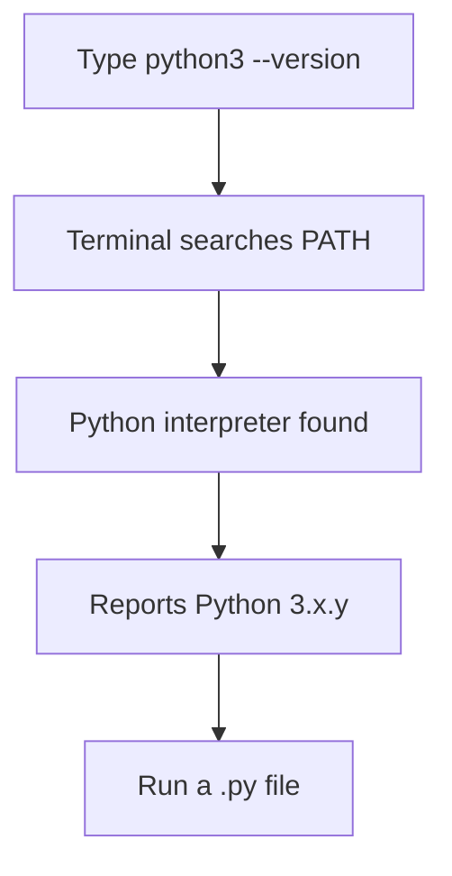

# Installing Python

---

## Learning Objectives

Students will learn:

- How to install a current, supported Python 3 release safely on their operating system.
- How to verify the interpreter version and diagnose a command-not-found or wrong-version problem.
- Why version selection, PATH, and virtual environments matter for reliable projects.

---

## Prerequisites

Read Lesson 001 – Introduction to Python. You do not need previous installation experience.

---

## Why This Matters

Before a computer can execute Python code, it needs the Python interpreter. Installing it correctly gives you a dependable foundation for every later exercise, script, API, and AI project. A wrong command can run an old interpreter, while a missing PATH entry can make a correct installation look broken.

Python versions matter because the language and its security fixes evolve. A project also needs predictable dependencies: installing every package globally can cause one project to break another. This lesson starts with a safe system installation; Lesson 041 covers virtual environments in depth.

---

## Theory

The Python interpreter is an executable program. When you enter `python --version` in a terminal, your operating system searches locations listed in its **PATH** environment variable for a command named `python`. The first matching command runs.

That search explains two common surprises. First, a computer can contain multiple Python versions. Second, a successful installer may not add its command to PATH. Do not guess which interpreter is running; ask it for its version and location.

Use a maintained Python 3 release from [python.org](https://www.python.org/downloads/), your operating system's trusted package manager, or an organization-approved development environment. Avoid unknown download sites and avoid replacing a system-managed Python that your operating system depends on.

---

## Mental Model

Imagine Python installations as separate workshops. Each has its own interpreter and may eventually have its own tools. PATH is the signpost that tells the terminal which workshop to enter when you type a command. A virtual environment is a project-specific workbench inside that workshop, keeping project packages separate.

For now, your goal is modest: identify one supported Python 3 interpreter and prove it can execute a file.

---

## Visual Explanation



---

## Syntax

Open a terminal: Terminal on macOS, PowerShell on Windows, or a terminal emulator on Linux. Run the command that fits your platform:

```bash
python3 --version
```

On many Windows installations, use the Python launcher instead:

```powershell
py --version
```

You should see `Python 3` followed by a version number. `python --version` may also work, but `python3` helps distinguish Python 3 from older Python commands on macOS and Linux. Use the command that you verified consistently in future lessons.

---

## Code Example 1

Create a file named `verify_install.py` with the following runnable code:

```python
import platform
import sys

print("Python version:", sys.version.split()[0])
print("Interpreter path:", sys.executable)
print("Operating system:", platform.system())
```

Run it from the folder containing the file:

```bash
python3 verify_install.py
```

On Windows with the launcher, run `py verify_install.py`. The `sys` module exposes information about the currently running Python process. `sys.executable` is particularly useful when multiple installations exist: it shows the exact interpreter that executed your script.

---

## Code Example 2

This second check confirms that the interpreter can perform ordinary Python work, not only report its version.

```python
from datetime import date

today = date.today()
release_year = today.year
print(f"Python is ready for projects in {release_year}.")
```

Save it as `python_ready.py` and run it with the same command you used above. `datetime` is part of Python's standard library, so it requires no extra installation. The `f` before the string lets Python insert the value of `release_year` between the braces.

---

## Real World Example

A data team deploys an API that creates financial reports. If one developer uses Python 3.12 and production uses an unsupported Python 3.8 build, a dependency may behave differently or fail to install. Teams record their supported version in project documentation and configure continuous integration to test it.

For a personal project, add the output of `python3 --version` to your notes or README. For a shared project, follow its documented Python version exactly. Consistent interpreter versions reduce the familiar problem of code working on one computer but not another.

---

## Common Mistakes

- Installing from a third-party download page. Obtain Python from a trusted source or an approved package manager.
- Running `python` without checking its version. It may refer to a different installation than expected.
- Selecting the Windows installer option that omits Python from PATH, then assuming installation failed. Re-run the installer or use the `py` launcher.
- Using administrator privileges when they are not needed. A user-level install is safer on a personal machine.
- Installing project packages globally. This can create version conflicts; use a virtual environment when you begin installing packages.

---

## Best Practices

- Prefer a current supported Python 3 release and apply security updates through your trusted installation method.
- Verify version, executable path, and a small script immediately after installation.
- Keep a note of the command that works on your operating system: `python3` or `py`.
- Use only one intended interpreter per project and document it in the project README.
- Never paste access tokens, passwords, or private paths into public support requests while troubleshooting.

---

## Performance Notes

Installation itself is not a performance decision for small scripts. For production systems, version choice can affect startup time and library compatibility, but correctness, support status, and reproducibility should be chosen before tiny performance differences.

---

## Mini Exercise

1. Run your platform's version command and record the full Python version.
2. Run `verify_install.py`. Which path does `sys.executable` report?
3. Intentionally type `pythno --version`. Read the error, correct the spelling, and run the correct command.

---

## Mini Project

Create `environment_report.py`. Print the Python version, interpreter path, operating-system name, and today's date. Run it from the terminal and save the output in your learning notes. This is a useful diagnostic script to keep when starting a new machine or project.

---

## Quiz

1. What does PATH help the terminal do?
   - A. Find commands to run
   - B. Write Python syntax
   - C. Encrypt a file
   - D. Create a database

2. Which module exposes the active interpreter path?
   - A. `math`
   - B. `sys`
   - C. `random`
   - D. `json`

3. Which is a safe source for a personal Python installation?
   - A. An unknown download mirror
   - B. A link in an unsolicited message
   - C. python.org
   - D. A copied executable from a chat room

4. Why should a shared project document its Python version?
   - A. To make code look longer
   - B. To reduce environment differences
   - C. To avoid files ending in `.py`
   - D. To remove testing

5. What should you do after installing Python?
   - A. Install every package globally
   - B. Verify the version and run a small script
   - C. Disable updates forever
   - D. Delete the terminal

**Answers:** 1-A, 2-B, 3-C, 4-B, 5-B.

---

## Interview Questions

### Beginner

How do you check that Python is installed, and what output do you expect?

### Intermediate

What could cause `python --version` and a script run to use different Python installations?

### Advanced

How would you make Python version and dependency setup reproducible for a service deployed by several developers and a CI pipeline?

---

## Summary

Python code needs an interpreter to run. Install a supported Python 3 version from a trusted source, then verify its version, executable path, and ability to run a small script. PATH decides which command the terminal finds, so checking the active interpreter is more reliable than assuming. Project-specific environments will later keep dependencies isolated.

---

## Next Lesson

Continue to [Lesson 003 – Running Python](../003-running-python/) to use the interactive shell and execute Python files confidently.
