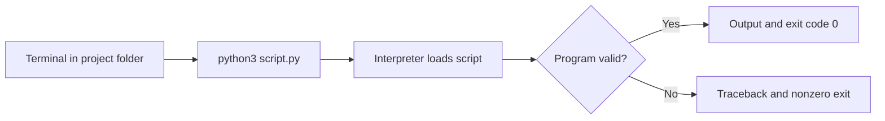

# Running Python

---

## Learning Objectives

Students will learn:

- How to run Python interactively and execute a `.py` script from a terminal.
- How the current folder, file name, exit code, and output affect program execution.
- How to run scripts safely and debug common launch errors.

---

## Prerequisites

Complete Lesson 002 – Installing Python and confirm that `python3 --version` or `py --version` works on your computer.

---

## Why This Matters

Writing code is only half of programming. You also need to execute it in a known environment, inspect what happened, and repeat the process reliably. Whether you are testing a one-line idea, generating a report every morning, or running an AI data-preparation job, knowing how Python starts makes failures easier to diagnose.

Python offers two useful modes. The interactive shell is a conversation with the interpreter, excellent for quick experiments. A script is a saved sequence of instructions, excellent for work that must be reviewed, rerun, tested, or shared. Professional work favors scripts for durable behavior and uses the shell to explore small questions.

---

## Theory

A terminal has a **current working directory**: the folder from which it resolves relative file names. If `sales_report.py` is in `Documents/python-practice`, you must either change into that folder or give Python the file's path. On macOS and Linux, `pwd` shows the current folder and `ls` lists its contents. In PowerShell, use `Get-Location` and `Get-ChildItem`.

When you run `python3 sales_report.py`, the operating system starts the interpreter, Python loads the file, and Python executes statements from top to bottom. If it finishes successfully, the process usually exits with code `0`. A nonzero exit code usually signals a problem. The terminal displays standard output, such as `print()` messages, and errors on standard error.

The interactive prompt is shown as `>>>`. It evaluates an expression when you press Enter. Use `exit()` to leave. Do not type the `>>>` characters into a script; they belong to the shell display, not Python syntax.

---

## Mental Model

Treat a script run as a delivery: the terminal chooses the folder, Python chooses the interpreter, and the interpreter receives a file. The file's statements execute in order and produce output or an error. When something fails, identify which handoff failed: wrong folder, wrong file name, wrong interpreter, invalid Python code, or an incorrect rule.

This layered model keeps debugging calm and specific. First prove the command reaches the intended file; then examine the code and data.

---

## Visual Explanation



---

## Syntax

Start the interactive shell with one verified command:

```bash
python3
```

Then enter this expression at the `>>>` prompt. The code block intentionally
contains only Python source, so it can also be saved and executed as a script:

```python
result = 7 * 6
print(result)
```

To run a saved file, create `hello.py`, change to its folder, and run it:

```bash
cd path/to/your/folder
python3 hello.py
```

Replace `python3` with `py` on Windows when that is the command you verified in Lesson 002. Replace `path/to/your/folder` with a real path; it is an instruction, not text to copy unchanged.

---

## Code Example 1

Create `hello.py`:

```python
name = "Mina"
message = f"Hello, {name}. Your Python script is running."
print(message)
```

Run `python3 hello.py`. A file ending in `.py` is a Python source file. Running it repeatedly should produce the same output because the data and instructions have not changed. The formatted string makes the output readable while keeping the name as separate data.

---

## Code Example 2

Create `daily_revenue.py`. This script accepts no input yet, but it models a repeatable business calculation.

```python
def calculate_net_revenue(gross_revenue, refund_amount):
    return gross_revenue - refund_amount


gross_revenue = 1250.00
refund_amount = 85.50
net_revenue = calculate_net_revenue(gross_revenue, refund_amount)

print(f"Net revenue: ${net_revenue:.2f}")
```

Run the script from its folder. The `:.2f` format specification displays two decimal places, appropriate for a simple currency display. Real financial systems should use decimal-safe representations and clear rounding rules; this example uses floats only to demonstrate launching a script.

---

## Real World Example

A marketing analyst may receive a CSV export each morning and run a Python script that cleans column names, removes incomplete rows, and creates a report. The script is safer than a manual sequence because it is saved, reviewable, and rerunnable. In production, a scheduler might run the same command at a fixed time, capture logs, alert on a nonzero exit code, and store the generated report.

Before automating any script, run it manually with representative input. Make output locations explicit, avoid overwriting important files unintentionally, and make failures visible. These operational habits are as important as the calculation itself.

---

## Common Mistakes

- Running the command from the wrong folder, so Python reports that it cannot open the file. Use `pwd`/`Get-Location` and list files first.
- Naming a file `python.py`, `random.py`, or `json.py`. It can shadow a standard-library module. Use specific names such as `daily_revenue.py`.
- Saving `hello.py.txt` by accident. Configure your editor to show file extensions and verify the name in the terminal.
- Copying the `>>>` prompt into a `.py` file, which causes a syntax error.
- Ignoring a traceback. Read the final line first; it usually names the error type and the line that triggered it.

---

## Best Practices

- Keep each script in a dedicated project folder and run it from that folder during early learning.
- Use descriptive lowercase file names with underscores, such as `daily_revenue.py`.
- Make small changes, run the script, and inspect the output after each change.
- Print useful, non-sensitive diagnostic values while developing; remove or replace noisy prints with logging as projects grow.
- Check the command's exit status in automated workflows so a failed script is not mistaken for a successful report.

---

## Performance Notes

Starting Python has a small fixed cost. For short automation scripts, clarity and correct I/O dominate. For a process that must handle large files or run continuously, measure startup time, memory use, and data-processing time separately before optimizing.

---

## Mini Exercise

1. Open the interactive shell, evaluate `12 + 30`, then leave with `exit()`.
2. Create `greeting.py` that prints a greeting containing your name. Run it from its folder.
3. Change the refund in `daily_revenue.py`, rerun the script, and explain how the output changed.

---

## Mini Project

Build `shipping_estimate.py`. Store an item price, quantity, and shipping fee. Create a function that calculates the order total, then print a two-decimal currency result. Run the file three times after changing the quantity. Keep the calculation in the function and the sample data below it so another person can reuse the rule.

---

## Quiz

1. What does `>>>` indicate?
   - A. A Python interactive prompt
   - B. A required script comment
   - C. A file extension
   - D. A package installer

2. What does a current working directory affect?
   - A. The color of Python code
   - B. How relative file names are found
   - C. Whether variables exist
   - D. The Python language version

3. What exit code usually indicates successful completion?
   - A. `-1`
   - B. `0`
   - C. `404`
   - D. `999`

4. Which is a sensible Python script name?
   - A. `json.py`
   - B. `python.py`
   - C. `daily_revenue.py`
   - D. `my script.py.txt`

5. Where should you start reading a traceback?
   - A. The final line describing the exception
   - B. A random web page
   - C. The file's first blank line
   - D. The terminal title

**Answers:** 1-A, 2-B, 3-B, 4-C, 5-A.

---

## Interview Questions

### Beginner

What is the difference between the Python interactive shell and a Python script?

### Intermediate

A script cannot be opened when launched from a terminal. What checks would you perform before changing its code?

### Advanced

How would you operationalize a daily Python report so failures are detected, output is traceable, and sensitive information is not exposed in logs?

---

## Summary

Use the interactive shell for quick experiments and `.py` files for repeatable work. To run a script, be deliberate about your current folder, interpreter command, and filename. Python executes the file from top to bottom, prints output, and returns an exit status. When a run fails, use the traceback and verify the execution handoffs before assuming the logic is wrong.

---

## Next Lesson

Continue to Lesson 004 – Variables, where you will learn how Python stores and updates information using meaningful names.
