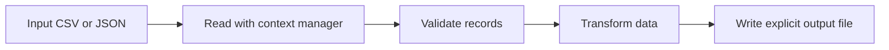

# Lesson 012 – File Handling

## Learning Objectives

- Read and write text, JSON, and CSV files safely with Python.
- Choose file modes and paths deliberately.
- Build a small, reliable data-ingestion workflow.

## Prerequisites

Complete Lessons 001–011. You should be comfortable with variables, conditions, loops, functions, and imports.

## Why This Matters

Programs need durable storage. A variable disappears when a process stops; a file can preserve a report, configuration, model input, or audit record. AI and data systems commonly begin with files: a CSV export of customer events, JSON annotations, or plain-text documents for a retrieval system.

File handling is more than calling `open()`. Production code must use the intended folder, close resources, choose an encoding, validate content, and avoid replacing important data accidentally. These habits make a script repeatable on another computer and safer to automate.

## Theory

A **file** is named data stored by an operating system. A **path** identifies its location. Relative paths are interpreted from the process's current working directory, so they can break when a script is launched elsewhere. `pathlib.Path` represents paths clearly and works across operating systems.

`open()` returns a file object. Its mode decides what is permitted: `"r"` reads, `"w"` creates or replaces a file, `"a"` appends, and `"x"` creates a file only when it does not already exist. Text mode is the default; use `encoding="utf-8"` for predictable text handling. A context manager, written with `with`, closes the file even when an error occurs.

Structured formats give data a shape. JSON stores nested records such as dictionaries and lists. CSV stores tabular rows. Use Python's `json` and `csv` modules instead of manually splitting commas or constructing JSON strings.

## Mental Model

Treat a file boundary like a border between your program and an external system. At that border, data may be absent, malformed, unexpectedly large, or in the wrong encoding. Read the data, validate it, transform it in memory, and write a deliberate output. Do not assume the file is trustworthy only because it is local.

## Mermaid Diagram



## Core Concepts

| Concept | Use | Important detail |
|---|---|---|
| `Path` | Build and inspect paths | Avoid manual path separators |
| `with open(...)` | Read or write text | Closes the file reliably |
| UTF-8 | Encode text predictably | Specify it for text files |
| JSON | Exchange nested records | Use `json.load` and `json.dump` |
| CSV | Exchange tables | Use `csv.DictReader` for named columns |

## Multiple Examples

### Read and write a text report

```python
from pathlib import Path

report_path = Path("reports") / "model_status.txt"
report_path.parent.mkdir(parents=True, exist_ok=True)

status = "classification-model: healthy\nlast_refresh: 2026-07-29\n"
report_path.write_text(status, encoding="utf-8")

saved_status = report_path.read_text(encoding="utf-8")
print(saved_status)
```

`mkdir(..., exist_ok=True)` creates the output folder once and does not fail if it already exists. `write_text` is concise for a complete text value. For large files or line-by-line work, use `open()` and iterate instead.

### Process JSON annotations

```python
import json
from pathlib import Path

annotations = [
    {"id": "ticket-101", "label": "billing", "confidence": 0.94},
    {"id": "ticket-102", "label": "technical", "confidence": 0.87},
]
path = Path("annotations.json")

with path.open("w", encoding="utf-8") as file:
    json.dump(annotations, file, indent=2)

with path.open("r", encoding="utf-8") as file:
    loaded_annotations = json.load(file)

high_confidence = [item for item in loaded_annotations if item["confidence"] >= 0.90]
print(high_confidence)
```

`indent=2` makes an output file reviewable. In real ingestion code, also check that each record has the expected keys and value types before using it.

### Summarize a CSV dataset

```python
import csv
from pathlib import Path

source = Path("evaluation_scores.csv")
rows = [
    {"model": "baseline", "accuracy": "0.81"},
    {"model": "candidate", "accuracy": "0.87"},
]

with source.open("w", newline="", encoding="utf-8") as file:
    writer = csv.DictWriter(file, fieldnames=["model", "accuracy"])
    writer.writeheader()
    writer.writerows(rows)

with source.open(newline="", encoding="utf-8") as file:
    scores = [float(row["accuracy"]) for row in csv.DictReader(file)]

print(f"Average accuracy: {sum(scores) / len(scores):.2%}")
```

`newline=""` lets the CSV module handle line endings correctly. File contents are text, so numeric strings need intentional conversion.

## Did You Know

File objects are iterable. `for line in file:` reads a text file one line at a time, which is usually more memory-efficient than calling `read()` on a large log file.

## Common Mistakes

- Using `"w"` for a valuable file without realizing it replaces existing contents.
- Building paths with hard-coded `/` or `\\` instead of `Path`.
- Forgetting UTF-8 and seeing different results on another machine.
- Parsing CSV with `line.split(",")`; quoted commas make that incorrect.
- Loading a multi-gigabyte file into memory when streaming rows would work.

## Best Practices

- Keep source data and generated output in separate folders.
- Use `with` or `Path.read_text`/`write_text` so resources are closed.
- Validate headers, required fields, and conversions at input boundaries.
- Write outputs atomically when a partial file would be harmful: write a temporary file, validate it, then replace the target.
- Never place credentials, tokens, or personal data in sample files committed to version control.

## Production Insight

For recurring ML pipelines, treat file names and schemas as contracts. Include a dataset version or date in an input manifest, log record counts, and reject unexpected schema changes. A successful script that silently reads yesterday's file can cause more damage than a visible failure.

File permissions are also part of the contract. A process should write only to its intended output directory and should not accept an untrusted path that could escape it. When user input determines a filename, validate it against an allowlist or construct a generated identifier yourself. This is particularly important for web applications and multi-tenant data platforms.

## Interview Tip

When asked how you handle files, mention resource safety (`with`), path portability (`pathlib`), encoding, validation, and behavior for missing or malformed input. These details show engineering judgment beyond basic syntax.

## Real World Examples

- A retrieval-augmented generation system reads approved policy documents, normalizes their text, and writes chunk metadata as JSON.
- A fraud-monitoring job streams transaction rows from CSV, validates currency values, and writes a daily exception report.
- A model-evaluation service stores metrics as JSON so dashboards and automated quality gates can consume them.

For each case, a sensible operational record includes the source path or version, start time, number of records read, number rejected, output path, and final status. That small amount of metadata makes an incident reproducible without logging the sensitive contents of every document.

## Mini Exercises

1. Create `notes.txt`, write three learning notes with UTF-8, then read and print them.
2. Create a JSON list of two model records with `name` and `f1_score`, then select records above `0.85`.
3. Read a CSV with `name` and `minutes_studied` columns and calculate the total minutes.

## Mini Project

Build `dataset_audit.py`. Read a CSV of labeled support tickets with `ticket_id`, `text`, and `label`. Count labels, reject rows with blank required fields, and write `audit_summary.json` containing the total, rejected count, and label counts. Keep the input and output paths at the top of the script. Test with a deliberately incomplete row.

## Quiz

See [quiz.json](./quiz.json) for ten multiple-choice questions and explanations.

## Interview Questions

### Beginner

What does a context manager do when working with a file?

### Intermediate

Why is `csv.DictReader` safer than splitting each CSV line on commas?

### Advanced

How would you make a file-based data pipeline safe against partial output and schema drift?

## Key Takeaways

- Files persist data beyond a program run, but must be treated as external input.
- `pathlib`, UTF-8, and context managers make common file work safer.
- JSON and CSV modules preserve structure better than manual text parsing.
- Validate inputs and make outputs explicit, reviewable, and reproducible.

## Flashcards Preview

- **`r` mode:** opens an existing file for reading.
- **`w` mode:** writes a file and replaces its old contents.
- **Context manager:** guarantees cleanup after the block completes.
- **`Path`:** portable representation of a filesystem path.

See [flashcards.json](./flashcards.json) for the complete set.

## Cheat Sheet

See [cheatsheet.md](./cheatsheet.md) for file modes, `pathlib`, JSON, and CSV patterns.

## Summary

Python file handling connects programs to durable data. Use explicit paths, UTF-8 text encoding, context managers, and standard parsers. Once files are treated as validated boundaries rather than trusted strings, scripts become suitable building blocks for data and AI workflows.

## Next Lesson

Continue to [Lesson 013 – Exception Handling](../013-exception-handling/) to make file and data workflows fail safely and informatively.
