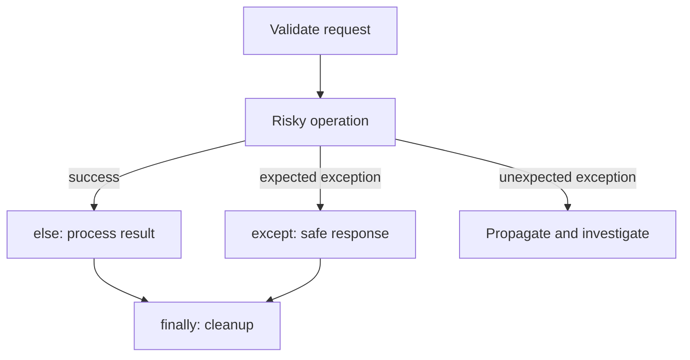

# Lesson 013 – Exception Handling

## Learning Objectives

- Explain exceptions and distinguish expected failures from programming bugs.
- Handle specific errors with `try`, `except`, `else`, and `finally`.
- Design error messages and validation for a production data workflow.

## Prerequisites

Complete Lessons 001–012, especially functions, modules, and file handling.

## Why This Matters

External data, files, networks, and users are not perfectly reliable. A report file can be missing, a CSV value can be malformed, and an API can time out. Without a plan, one bad input can terminate a useful program. With an overly broad plan, a program can hide a serious bug and continue with corrupt results.

Exception handling lets code state what failure it expects, what it can safely recover from, and what information a developer needs to diagnose it. It is essential for automation, APIs, and ML pipelines where visible, actionable failure is better than silent bad data.

## Theory

An **exception** is an object that signals an abnormal condition during execution. Python stops normal flow and searches for a matching `except` block. `ValueError` often indicates an unacceptable value, `FileNotFoundError` indicates a missing file, and `KeyError` indicates a missing dictionary key.

Place only the operation that may fail inside `try`. Catch the most specific expected exception, provide a useful recovery or message, and let unexpected problems propagate. `else` runs only when no exception occurred. `finally` runs whether the operation succeeded or failed, making it suitable for cleanup.

Use `raise` when code detects an invalid state that its caller must address. Custom exceptions can communicate domain meaning, such as an unsupported dataset schema. Exceptions do not replace validation: validate known rules before attempting work, then handle failures that remain possible.

## Mental Model

Think of a `try` block as a guarded boundary. Inside is one risky operation; outside is the normal workflow. The `except` block is not a broom for every error. It is a deliberate decision: “If this known situation occurs, here is the safe response.” Unknown failures should retain their traceback so they can be fixed.

## Mermaid Diagram



## Core Concepts

| Construct | Purpose | Example |
|---|---|---|
| `try` | Holds a narrow risky operation | parse external input |
| `except ValueError` | Handles one expected failure | invalid number |
| `else` | Runs after success only | save processed result |
| `finally` | Runs in every outcome | release a resource |
| `raise` | Signals a rule violation | reject invalid schema |

## Multiple Examples

### Parse a model threshold safely

```python
def parse_threshold(raw_threshold):
    try:
        threshold = float(raw_threshold)
    except (TypeError, ValueError) as error:
        raise ValueError("threshold must be a number between 0 and 1") from error

    if not 0 <= threshold <= 1:
        raise ValueError("threshold must be between 0 and 1")
    return threshold


print(parse_threshold("0.82"))
```

The function validates a known business rule after conversion. `from error` preserves the original cause while giving callers a clear domain-level message.

### Read an optional configuration file

```python
import json
from pathlib import Path

config_path = Path("model_config.json")

try:
    with config_path.open(encoding="utf-8") as file:
        config = json.load(file)
except FileNotFoundError:
    config = {"batch_size": 32, "max_retries": 3}
    print("Configuration not found; using safe defaults.")
except json.JSONDecodeError as error:
    raise RuntimeError(f"Invalid JSON in {config_path}") from error
else:
    print("Configuration loaded successfully.")

print(config)
```

The missing-file case has a safe default. Invalid JSON is not silently replaced because an operator should fix the configuration rather than unknowingly run with defaults.

### Always report a batch outcome

```python
def score_record(record):
    if "text" not in record:
        raise KeyError("record requires a text field")
    return len(record["text"])


record = {"text": "refund requested"}
try:
    score = score_record(record)
except KeyError as error:
    print(f"Skipped record: {error}")
else:
    print(f"Text length: {score}")
finally:
    print("Record attempt finished.")
```

`finally` is useful for a final status message, but resource cleanup is normally handled automatically by `with`.

## Did You Know

`except Exception` catches most ordinary runtime errors but not every control-flow exception. It is still usually too broad for application logic because it can hide bugs such as `AttributeError` or `TypeError` that deserve correction.

## Common Mistakes

- Writing `except:` or `except Exception: pass`, which hides failures and loses evidence.
- Putting an entire function in one `try`, making it unclear what failed.
- Catching `ValueError` and continuing with a guessed number when correctness matters.
- Showing raw internal exception details to end users, which can expose paths or implementation details.
- Using exceptions for ordinary loop control instead of validating predictable conditions.

## Best Practices

- Catch only exceptions you expect and can handle meaningfully.
- Include context in logs: operation, safe record identifier, and error type—not secrets or full sensitive content.
- Validate inputs at system boundaries and raise clear messages for callers.
- Preserve original causes with `raise NewError(...) from error` when translating exceptions.
- Test both successful and failing paths, including missing files and invalid data.

## Production Insight

Reliable services separate an error response for users from diagnostic logging for operators. An API might return `"invalid dataset format"` with a request ID, while secure logs contain the field name and traceback. Metrics should count error classes so a sudden increase in parsing failures becomes visible.

Define an error policy before shipping a batch job. For each failure type, decide whether to skip one record, retry with a limit, fail the whole job, or require human review. A retry should include a delay and a maximum attempt count; retrying a malformed request wastes capacity and delays a useful error. The policy should be visible in code and tests, not an accidental collection of `except` blocks.

## Interview Tip

Avoid saying that exceptions should be caught everywhere. Explain that narrow, specific handling is useful where recovery is safe, while unexpected exceptions should be logged and fixed. This is the central tradeoff interviewers look for.

## Real World Examples

- A data-ingestion job skips and records malformed rows but fails the batch if too many rows are invalid.
- An AI API retries transient network errors with a bounded policy but does not retry an invalid request.
- A configuration loader falls back only for an absent optional file, not for corrupted configuration.

In all three examples, success and failure should be observable. A successful retry, a skipped record, and a failed batch are different business events. Record their counts so operators can distinguish a healthy system from one that only appears healthy because it suppressed errors.

## Mini Exercises

1. Write `to_positive_int(value)` that raises `ValueError` for zero, negative, or nonnumeric values.
2. Read a text file and print a friendly message if it does not exist.
3. Add an `else` and `finally` block to a small JSON-loading program and describe when each runs.

## Mini Project

Build `prediction_loader.py`. Load prediction records from JSON, require each record to have `id` and numeric `score`, and collect invalid records with a reason. Print a valid/invalid summary. Raise an error if the input file is missing or if more than 5% of records are invalid. Do not catch unexpected programming errors.

## Quiz

See [quiz.json](./quiz.json) for ten multiple-choice questions and explanations.

## Interview Questions

### Beginner

What is an exception, and when does Python search for an `except` block?

### Intermediate

Why is `except Exception: pass` dangerous in a data-processing script?

### Advanced

How would you distinguish retryable, user-correctable, and internal errors in an API that calls an AI model?

## Key Takeaways

- Exceptions signal abnormal runtime conditions.
- Narrow `try` blocks and specific handlers preserve clarity.
- Validation handles known rules; exceptions handle failures that still occur.
- Safe recovery, useful context, and visible unexpected errors produce trustworthy systems.

## Flashcards Preview

- **`try`:** contains an operation that may raise an exception.
- **`else`:** runs only if the `try` block succeeds.
- **`finally`:** runs regardless of success or failure.
- **Exception chaining:** keeps an original cause when raising a clearer error.

See [flashcards.json](./flashcards.json) for the complete set.

## Cheat Sheet

See [cheatsheet.md](./cheatsheet.md) for common exception patterns.

## Summary

Exception handling is a design tool for unreliable boundaries. Catch specific expected failures, recover only when the outcome remains safe, and preserve unexpected failures for investigation. Paired with validation, this makes file, API, and data workflows reliable instead of merely optimistic.

## Next Lesson

Continue to [Lesson 014 – Object-Oriented Programming](../014-object-oriented-programming/) to organize related data and behavior into reusable objects.
