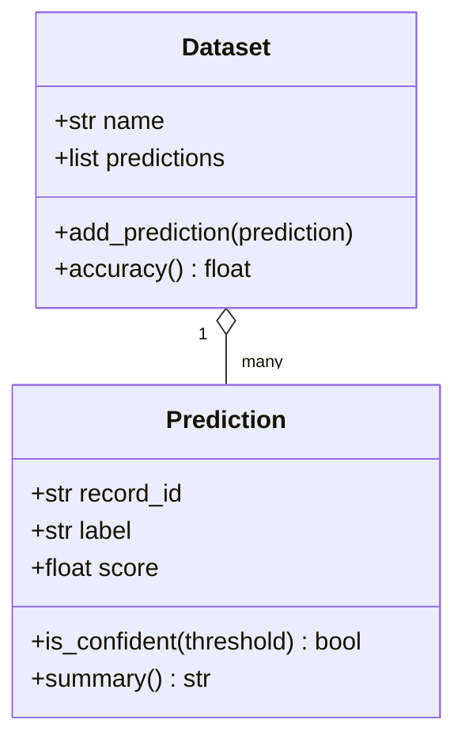

# Lesson 014 – Object-Oriented Programming

## Learning Objectives

- Explain classes, objects, attributes, methods, and constructors.
- Model a cohesive real-world domain with Python classes.
- Use encapsulation and dataclasses to create maintainable code.

## Prerequisites

Complete Lessons 001–013. You should understand functions, dictionaries, imports, and exceptions.

## Why This Matters

As a program grows, related data and operations can become scattered across unrelated variables and functions. Object-oriented programming (OOP) groups a domain concept with the behavior that protects and changes it. A `Dataset`, `Prediction`, or `SupportTicket` object can hold its own state and expose clear operations.

OOP is not required for every script. A small transformation can be clearer as a function. It becomes valuable when several pieces of state must obey the same rules or when a model has a meaningful identity and lifecycle. Good OOP reduces accidental misuse by making valid operations obvious.

## Theory

A **class** is a blueprint; an **object** (also called an instance) is a concrete value created from that blueprint. Attributes store object state. Methods are functions defined in the class that operate on that state. `__init__` is the initializer that runs when an object is created. The first method parameter, conventionally named `self`, refers to the current object.

**Encapsulation** means keeping an object's rules close to its state. Instead of allowing any code to assign an invalid confidence score, provide a method or property that validates it. Python uses conventions rather than strict private fields: a leading underscore signals implementation detail. Properties let an attribute-like API enforce rules.

`@dataclass` reduces boilerplate for classes primarily used to hold data. It can generate an initializer and readable representation, but it does not replace thoughtful validation or behavior.

## Mental Model

Think of an object as a reliable record with verbs. A prediction is not only a dictionary of `label` and `score`; it can answer whether it is confident enough, validate its score, and create a safe summary. The class defines what states are allowed and which verbs can change them.

## Mermaid Diagram



## Core Concepts

| Concept | Meaning | Typical use |
|---|---|---|
| Class | Blueprint for objects | `class Prediction:` |
| Instance | One object from a class | a prediction for one record |
| Attribute | State stored on an object | `self.score` |
| Method | Object behavior | `prediction.summary()` |
| Encapsulation | Keep rules with state | validate score on creation |

## Multiple Examples

### Create a validated prediction object

```python
class Prediction:
    def __init__(self, record_id, label, score):
        if not 0 <= score <= 1:
            raise ValueError("score must be between 0 and 1")
        self.record_id = record_id
        self.label = label
        self.score = score

    def is_confident(self, threshold=0.80):
        return self.score >= threshold

    def summary(self):
        return f"{self.record_id}: {self.label} ({self.score:.1%})"


prediction = Prediction("ticket-42", "billing", 0.91)
print(prediction.summary())
print(prediction.is_confident())
```

Every `Prediction` begins in a valid state because the initializer checks the score. Methods receive `self` automatically when called on an object.

### Use a dataclass for a record

```python
from dataclasses import dataclass


@dataclass(frozen=True)
class DocumentChunk:
    document_id: str
    chunk_index: int
    text: str

    def word_count(self):
        return len(self.text.split())


chunk = DocumentChunk("policy-7", 0, "Refunds are available within thirty days.")
print(chunk.word_count())
```

`frozen=True` prevents reassignment after creation. Immutable value objects are useful for data passed through a pipeline because a later step cannot silently modify an earlier result.

### Compose objects into a collection

```python
class EvaluationBatch:
    def __init__(self, name):
        self.name = name
        self._scores = []

    def add_score(self, score):
        if not 0 <= score <= 1:
            raise ValueError("score must be between 0 and 1")
        self._scores.append(score)

    def average_score(self):
        if not self._scores:
            raise ValueError("cannot average an empty batch")
        return sum(self._scores) / len(self._scores)


batch = EvaluationBatch("july-evaluation")
for score in [0.82, 0.88, 0.91]:
    batch.add_score(score)
print(f"Average: {batch.average_score():.2%}")
```

`_scores` communicates that callers should use methods rather than edit the internal list directly. This gives the class one place to enforce valid scores.

## Did You Know

In Python, everything is an object, including strings, lists, functions, and classes. OOP is therefore not a separate mode you turn on; it is a way of designing your own types intentionally.

## Common Mistakes

- Creating a class for every tiny value when a function or dictionary would be clearer.
- Letting unrelated behavior accumulate in a large “manager” class.
- Exposing mutable internal lists and allowing callers to bypass validation.
- Using class attributes for per-object state, causing instances to unintentionally share data.
- Writing an initializer that accepts invalid state and expecting every caller to remember checks later.

## Best Practices

- Give each class one coherent responsibility.
- Make invalid states difficult to construct through validation at creation or mutation points.
- Prefer composition—objects containing or using other objects—before inheritance.
- Use dataclasses for simple value objects; use ordinary classes when behavior and invariants dominate.
- Add type hints as classes become shared interfaces, for example `def add_score(self, score: float) -> None`.

## Production Insight

Objects can make observability consistent. A `JobResult` object might hold a run ID, counters, timestamps, and failure reasons, then provide a single method to produce safe structured logs. This avoids many scripts inventing slightly different report formats.

Choose the representation that keeps the boundary clearest. A dictionary is often appropriate for loosely structured JSON arriving from an API. Convert it to a class or dataclass once your application relies on stable fields, validation, and behavior. This conversion point prevents unvalidated dictionaries from spreading through a codebase while avoiding premature classes at the network boundary.

## Interview Tip

Explain OOP through cohesion, not jargon: a class groups data with the rules that operate on it. Then mention that you would not force a class where a pure function is simpler. This demonstrates pragmatic design judgment.

## Real World Examples

- A `FeatureSchema` class validates names, data types, and allowed ranges before model training.
- A `Conversation` object manages ordered messages and token-budget calculations for an AI assistant.
- An `EvaluationBatch` object collects metrics while preventing invalid scores from entering reports.

For long-lived domain objects, define ownership of mutation. For example, a training run may add metrics through `record_metric()` but should not expose the mutable internal metrics dictionary directly. This gives the class a future path to validate metric names, attach timestamps, or emit audit events without changing every caller.

## Mini Exercises

1. Create a `Book` class with `title`, `author`, and a `description()` method.
2. Create a `ModelRun` class that rejects a negative duration in `__init__`.
3. Convert a simple immutable `UserPreference` record into a frozen dataclass.

## Mini Project

Build `prompt_registry.py`. Define a `PromptTemplate` class with `name`, `template`, and `version`. Reject blank names or templates. Add a `render(**values)` method that formats the template and raises a helpful error for missing placeholders. Create two templates, render them, and print a registry summary.

## Quiz

See [quiz.json](./quiz.json) for ten multiple-choice questions and explanations.

## Interview Questions

### Beginner

What is the difference between a class and an object?

### Intermediate

Why might a class validate a score in its initializer rather than leave validation to callers?

### Advanced

When would you choose a dataclass, a regular class, or a plain function for a new component in a data pipeline?

## Key Takeaways

- Classes define cohesive types; objects hold concrete state.
- Methods give state meaningful behavior, and initializers can enforce invariants.
- Encapsulation protects internal details and provides stable operations.
- Good OOP uses small, focused classes and does not replace simple functions unnecessarily.

## Flashcards Preview

- **Class:** a blueprint for objects.
- **Instance:** one object created from a class.
- **`self`:** the current object inside an instance method.
- **Dataclass:** a decorator for concise data-oriented classes.

See [flashcards.json](./flashcards.json) for the complete set.

## Cheat Sheet

See [cheatsheet.md](./cheatsheet.md) for class and dataclass patterns.

## Summary

Object-oriented programming organizes related state and behavior into cohesive types. Classes should enforce meaningful rules, expose deliberate operations, and remain small enough to understand. Used thoughtfully alongside functions, OOP makes complex domains easier to evolve.

## Next Lesson

Continue to [Lesson 015 – Advanced OOP](../015-advanced-oop/) to extend types with inheritance, polymorphism, abstract interfaces, and composition.
