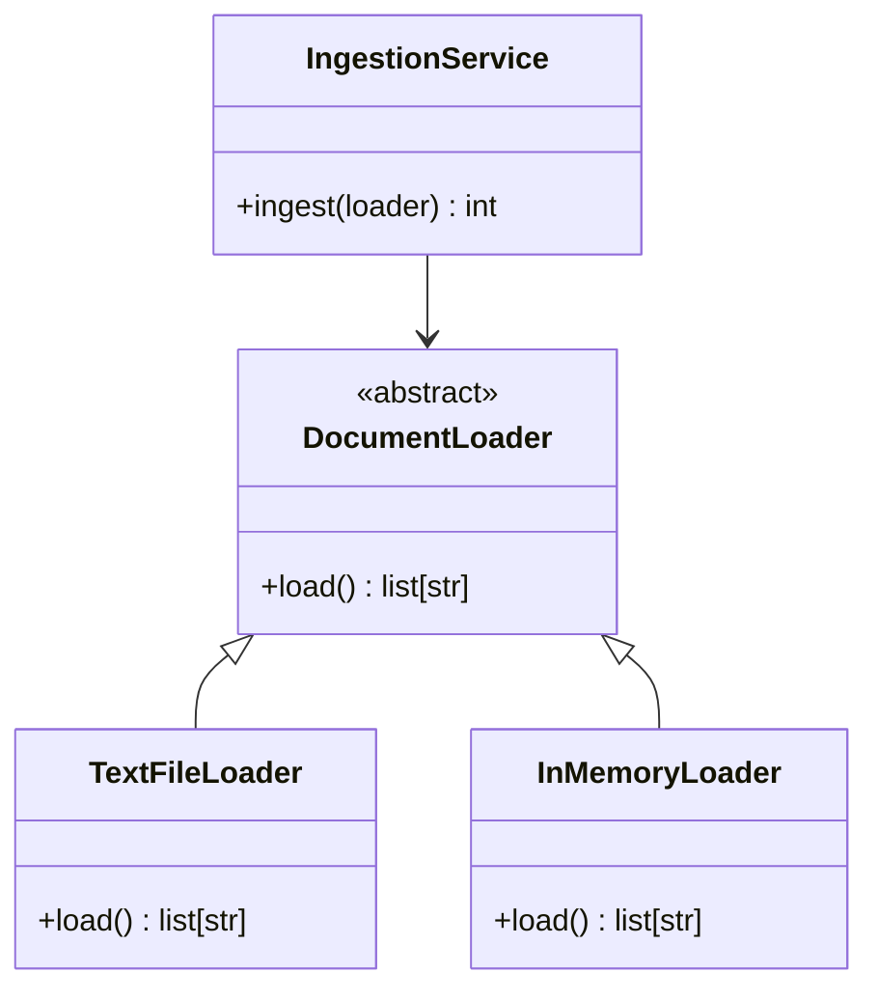

# Lesson 015 – Advanced OOP

## Learning Objectives

- Apply inheritance, polymorphism, abstract base classes, and composition appropriately.
- Use properties and special methods to create clear Python interfaces.
- Design extensible components for a production AI workflow.

## Prerequisites

Complete Lesson 014 – Object-Oriented Programming. You should be comfortable creating classes and methods.

## Why This Matters

Complex systems often need several implementations of the same capability. A document loader may read PDFs, web pages, and database records; an evaluation system may score classification, retrieval, and summarization tasks. Advanced OOP can define a stable contract while letting each implementation handle its own details.

These features are powerful, but overuse creates rigid hierarchies. The goal is not maximum abstraction. The goal is code that can add a capability without changing every caller, while remaining simple enough to test and explain.

## Theory

**Inheritance** lets a child class reuse or extend a parent class. **Polymorphism** means different objects can respond to the same method call in their own way. An **abstract base class** (ABC) declares an interface that concrete classes must implement. It is useful when callers need a capability but should not depend on a specific implementation.

**Composition** means one object contains or uses another. It is often safer than inheritance because behavior can be replaced without creating a deep family tree. Prefer composition unless the child truly is a specialized form of the parent and can honor the same contract.

Properties provide controlled access through attribute syntax. Special methods such as `__repr__` customize built-in behavior and should be used when they make a type easier to inspect, not merely to show off syntax.

## Mental Model

An interface is a promise. A caller can say “load this source” without knowing whether the source is a local file or an API. Each implementation keeps its own details, but all must return data in the promised shape. The best abstraction hides variation that callers should not care about; it does not hide important differences such as cost or failure behavior.

## Mermaid Diagram



## Core Concepts

| Concept | Purpose | Caution |
|---|---|---|
| Inheritance | Specialize a compatible parent | Avoid deep hierarchies |
| Polymorphism | Call one interface across types | Keep return contracts consistent |
| ABC | Require essential methods | Do not abstract a one-off |
| Composition | Assemble behavior from collaborators | Usually the default choice |
| Property | Validate controlled attribute access | Keep it unsurprising |

## Multiple Examples

### Define an abstract loader contract

```python
from abc import ABC, abstractmethod


class DocumentLoader(ABC):
    @abstractmethod
    def load(self) -> list[str]:
        """Return non-empty document texts."""


class InMemoryLoader(DocumentLoader):
    def __init__(self, documents: list[str]):
        self.documents = documents

    def load(self) -> list[str]:
        return [document for document in self.documents if document.strip()]


loader = InMemoryLoader(["Refund policy", "", "Account policy"])
print(loader.load())
```

The base class establishes the required `load` method. Callers can depend on that contract rather than branch on every loader type.

### Use polymorphism with composition

```python
from abc import ABC, abstractmethod


class DocumentLoader(ABC):
    @abstractmethod
    def load(self) -> list[str]:
        pass


class InMemoryLoader(DocumentLoader):
    def __init__(self, documents: list[str]):
        self.documents = documents

    def load(self) -> list[str]:
        return [document for document in self.documents if document.strip()]


class IngestionService:
    def __init__(self, loader: DocumentLoader):
        self.loader = loader

    def ingest(self) -> int:
        documents = self.loader.load()
        if not documents:
            raise ValueError("loader returned no documents")
        return len(documents)


service = IngestionService(InMemoryLoader(["FAQ", "Terms"]))
print(f"Ingested: {service.ingest()} documents")
```

`IngestionService` receives a loader instead of inheriting from one. Tests can supply `InMemoryLoader`, while production can supply a file or API loader with the same contract.

### Protect state with a property

```python
class RetryPolicy:
    def __init__(self, max_attempts: int):
        self.max_attempts = max_attempts

    @property
    def max_attempts(self) -> int:
        return self._max_attempts

    @max_attempts.setter
    def max_attempts(self, value: int) -> None:
        if not isinstance(value, int) or value < 1:
            raise ValueError("max_attempts must be a positive integer")
        self._max_attempts = value

    def __repr__(self) -> str:
        return f"RetryPolicy(max_attempts={self.max_attempts})"


policy = RetryPolicy(3)
print(policy)
```

The public attribute is easy to use while the setter guarantees a valid policy. `__repr__` supplies a useful developer-facing representation.

## Did You Know

Python uses duck typing: if an object provides the methods a caller needs, it can often work without inheriting from a shared base class. ABCs are still valuable when you want explicit contracts, shared documentation, or runtime enforcement.

## Common Mistakes

- Inheriting only to reuse a few lines of code when composition would be clearer.
- Making a child class violate a parent expectation, such as returning a different shape from `load()`.
- Creating abstract classes before there are multiple meaningful implementations.
- Using a property to perform slow network work; attributes should feel cheap and predictable.
- Checking exact types everywhere with `type(x) is ...` instead of relying on the needed interface.

## Best Practices

- Define small interfaces around a capability, not a large framework.
- Document input, output, errors, and side effects of an interface.
- Prefer constructor injection of collaborators; it makes tests deterministic.
- Keep inheritance shallow and use `super()` carefully when extending parent initialization.
- Test every implementation against the same behavioral expectations.

## Production Insight

An AI provider adapter is a common application. A `TextGenerator` interface can have OpenAI, local-model, and test-double implementations. The contract should expose meaningful differences—timeouts, token limits, and errors—rather than pretend all providers are identical. Keep credential handling outside domain objects and inject a configured client.

An interface becomes trustworthy when every implementation passes the same contract tests. For a document loader, tests can assert that empty documents are excluded, output is a list of strings, and a missing source raises a documented error. Run those tests against every new loader. This catches a “compatible” implementation that returns a generator, bytes, or silent empty result when callers expect something else.

## Interview Tip

For “inheritance versus composition,” lead with composition as the default. Choose inheritance only for a genuine is-a relationship with substitutable behavior. Give a concrete example: an ingestion service has a loader; it is not a loader.

## Real World Examples

- A document-ingestion service composes a loader, chunker, embedder, and repository.
- A model-evaluation framework calls different metric implementations through one `score()` interface.
- A retry policy uses a validated property so unsafe configuration cannot enter a network client.

Composition also enables targeted replacement during incidents. An ingestion service can temporarily receive a cached source while an API source is unavailable, without changing its chunking or persistence logic. The interface must still make the freshness tradeoff visible to the caller or operator.

## Mini Exercises

1. Create an ABC named `Exporter` with an abstract `export(records)` method and implement an in-memory exporter.
2. Write two objects with a `summarize(text)` method and pass each to the same caller.
3. Add a validated `timeout_seconds` property to a client configuration class.

## Mini Project

Build a document-ingestion prototype. Define a `TextSource` interface, implement `InMemoryTextSource` and `FileTextSource`, and create an `IngestionService` that returns non-empty documents. Use composition to inject the source. Add clear errors for an absent file and empty result. Write a small test script that runs both sources.

## Quiz

See [quiz.json](./quiz.json) for ten multiple-choice questions and explanations.

## Interview Questions

### Beginner

What is polymorphism in your own words?

### Intermediate

Why is composition often preferred to inheritance?

### Advanced

Design an interface for multiple LLM providers. Which behavior belongs in the interface, and which provider differences must remain explicit?

## Key Takeaways

- Inheritance supports specialization; polymorphism lets callers use a shared capability.
- Abstract classes can make important contracts explicit.
- Composition keeps components replaceable and is usually safer than inheritance.
- Properties and special methods improve an interface when they preserve clear expectations.

## Flashcards Preview

- **Polymorphism:** different objects respond to the same operation.
- **ABC:** a class that defines required behavior for subclasses.
- **Composition:** one object uses another object to do work.
- **Property:** controlled access exposed with attribute syntax.

See [flashcards.json](./flashcards.json) for the complete set.

## Cheat Sheet

See [cheatsheet.md](./cheatsheet.md) for inheritance, ABC, property, and composition patterns.

## Summary

Advanced OOP helps systems vary safely through focused contracts and replaceable components. Use interfaces and polymorphism where variation is real, composition as the default assembly tool, and inheritance only for compatible specialization. The result is extensible code without unnecessary framework complexity.

## Next Lesson

Continue to [Lesson 016 – Iterators, Generators & Decorators](../016-iterators-generators-decorators/) to learn Python tools for lazy processing and reusable behavior.
