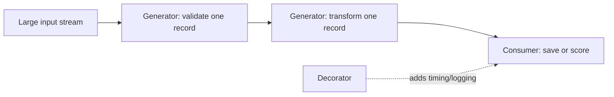

# Lesson 016 – Iterators, Generators & Decorators

## Learning Objectives

- Explain iterable objects, iterators, and lazy generator functions.
- Process large or streaming data with generators.
- Use decorators to add reusable behavior without changing core functions.

## Prerequisites

Complete Lessons 001–015. You should know loops, functions, exceptions, modules, and basic OOP.

## Why This Matters

Many real workloads do not fit comfortably in memory. A model-training pipeline may read millions of records, an API may stream events continuously, and a document processor may yield chunks one at a time. Iterators and generators let Python process values only when needed instead of building an entire list first.

Decorators solve a different but related design problem: adding cross-cutting behavior such as timing, authorization, caching, retries, or structured logging without mixing it into every business function. Used carefully, these features produce efficient, composable code. Used carelessly, they can hide control flow, so clarity remains the priority.

## Theory

An **iterable** can provide an iterator; lists, strings, dictionaries, and files are common examples. An **iterator** supplies values one at a time through `__next__()` until it raises `StopIteration`. A `for` loop calls this protocol for you.

A **generator** is a concise way to create an iterator. A function containing `yield` pauses after producing a value and resumes on the next request. Generator expressions use parentheses, such as `(score for score in scores if score > 0.8)`. Generators are lazy: they often reduce memory use, but they are consumed after iteration.

A **decorator** is a callable that receives a function and returns a replacement function, usually a wrapper. `@decorator_name` above a function applies it. Use `functools.wraps` so the wrapped function retains its name and documentation, which helps debugging and tooling.

## Mental Model

An iterator is a conveyor belt: ask for the next item, process it, then ask again. A list is a warehouse with every item already stored. A generator builds the conveyor belt as you walk beside it. A decorator is a transparent checkpoint around an operation: it can measure, log, validate, or authorize before and after the core work.

## Mermaid Diagram



## Core Concepts

| Concept | Key operation | Practical value |
|---|---|---|
| Iterable | `iter(value)` | supplies an iterator |
| Iterator | `next(iterator)` | produces one value at a time |
| Generator | `yield` | lazy custom iteration |
| Generator expression | `(item for item in source)` | compact lazy transformation |
| Decorator | `@name` | reusable function wrapping |

## Multiple Examples

### Inspect the iterator protocol

```python
labels = ["billing", "technical", "account"]
label_iterator = iter(labels)

print(next(label_iterator))
print(next(label_iterator))
print(next(label_iterator))
```

The fourth `next()` call would raise `StopIteration`. A `for` loop catches that signal internally, so use a loop when you want every item and `next()` only when you deliberately need one item.

### Stream validated records with a generator

```python
def valid_texts(records):
    for record in records:
        text = record.get("text", "")
        if isinstance(text, str) and text.strip():
            yield text.strip()


records = [
    {"text": " Reset my password "},
    {"text": ""},
    {"category": "billing"},
    {"text": "Where is my invoice?"},
]

for text in valid_texts(records):
    print(text)
```

`valid_texts` does not create a list of all valid texts. It evaluates each source record only as the loop asks for another value. This is useful when records come from a large file or network stream.

### Add timing with a decorator

```python
from functools import wraps
from time import perf_counter


def measure_duration(function):
    @wraps(function)
    def wrapper(*args, **kwargs):
        start = perf_counter()
        result = function(*args, **kwargs)
        elapsed = perf_counter() - start
        print(f"{function.__name__} took {elapsed:.6f} seconds")
        return result
    return wrapper


@measure_duration
def count_tokens_approximately(text):
    return len(text.split())


print(count_tokens_approximately("Reliable systems make failures visible."))
```

`@wraps` preserves metadata from `count_tokens_approximately`. The decorator returns the original result, so callers can use the function normally while receiving timing information during development.

### Compose generator stages

```python
def normalize(texts):
    for text in texts:
        yield " ".join(text.lower().split())


def chunks(texts, size):
    for text in texts:
        for start in range(0, len(text), size):
            yield text[start:start + size]


source = ["  Shipping   policy applies. ", "Refunds are reviewed."]
for chunk in chunks(normalize(source), size=12):
    print(chunk)
```

Each stage is independently testable and lazy. In an AI ingestion pipeline, later stages could tokenize, embed, and save chunks while avoiding a large intermediate list.

## Did You Know

Many built-ins are lazy or iterator-based: `enumerate`, `zip`, `map`, and file objects. Convert them to `list(...)` only when you genuinely need every value stored or need to iterate more than once.

## Common Mistakes

- Iterating over a generator once, then expecting it to produce the same values again.
- Replacing a clear list comprehension with a generator when the result must be reused and is small.
- Putting complicated business logic in stacked decorators, making errors hard to trace.
- Writing a decorator without `@wraps`, which obscures names and documentation.
- Using lazy processing to avoid solving an actual bottleneck such as slow network calls or an inefficient algorithm.

## Best Practices

- Use generators for large, streaming, or one-pass data; use lists when repeated access improves clarity.
- Keep generator stages narrow: validate, normalize, chunk, or write—not all at once.
- Document whether a function returns a reusable collection or a one-time iterator.
- Make decorators focused and transparent; return original results and preserve metadata with `wraps`.
- Measure memory and throughput before claiming a generator improved performance.

## Production Insight

Streaming pipelines require backpressure and error policy. If embedding one document is slower than reading documents, an unbounded producer can still overwhelm memory even with generators. In production, batch or queue work deliberately, record progress, and decide whether one invalid record should be skipped, retried, or fail the job.

## Interview Tip

Describe the tradeoff, not only the syntax: generators defer computation and reduce memory pressure, but they are single-pass and can make debugging less direct. For decorators, explain `wraps`, returned values, and a concrete cross-cutting use case such as timing or authorization.

## Real World Examples

- A log processor yields one event at a time, filters invalid events, and aggregates metrics without loading a full day of logs.
- A RAG pipeline yields cleaned document chunks to an embedding client in bounded batches.
- A service decorator attaches request IDs and duration metrics around endpoint functions.

## Mini Exercises

1. Use `iter()` and `next()` to retrieve two values from a tuple, then use a `for` loop for the rest.
2. Write `even_numbers(limit)` that yields even numbers below `limit`.
3. Create a decorator that prints a function's name before it runs, using `@wraps`.

## Mini Project

Build `streaming_dataset.py`. Create generators that read JSON-like records, yield only valid text records, normalize whitespace, and yield chunks no longer than 100 characters. Add a timing decorator to the function that consumes the chunks and counts them. Test that the input is processed one record at a time and that an invalid record does not stop the run.

## Quiz

See [quiz.json](./quiz.json) for ten multiple-choice questions and explanations.

## Interview Questions

### Beginner

What is the difference between an iterable and an iterator?

### Intermediate

When would a generator be a better choice than a list?

### Advanced

How would you design a streaming document-processing pipeline that manages failures, batching, and memory pressure?

## Key Takeaways

- Iterators produce values one at a time; `for` loops use this protocol automatically.
- Generators provide lazy, composable processing for one-pass workloads.
- Decorators add focused behavior around functions while preserving their core logic.
- Lazy code still needs clear contracts, measurement, and a deliberate error policy.

## Flashcards Preview

- **Iterable:** an object that can provide an iterator.
- **Iterator:** produces values with `next()` until exhaustion.
- **`yield`:** pauses a generator and supplies a value.
- **`wraps`:** preserves metadata of a decorated function.

See [flashcards.json](./flashcards.json) for the complete set.

## Cheat Sheet

See [cheatsheet.md](./cheatsheet.md) for iterator, generator, and decorator patterns.

## Summary

Iterators and generators let Python process data incrementally, which supports large and streaming workloads. Decorators add reusable operational behavior around functions. Choose these tools when their tradeoffs improve a design: preserve clarity, make one-pass behavior explicit, and measure the system rather than assuming laziness solves every performance problem.

## Next Lesson

Continue to the next Python curriculum lesson when available, building on these patterns for scalable and observable applications.
