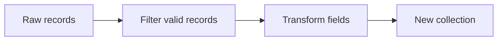

# Lesson 017 – Comprehensions

## Learning Objectives

- Build lists, sets, dictionaries, and generators from iterable data.
- Filter and transform data without obscuring business rules.
- Choose between a comprehension and an explicit loop.

## Prerequisites

Complete Lessons 001–016, especially loops, dictionaries, functions, and generators.

## Why This Matters

Data preparation often means turning many records into a clean, useful collection. Comprehensions express a common “iterate, filter, transform” workflow in one readable expression. They are useful for feature preparation, evaluation summaries, and API response shaping. They are not a substitute for named functions when the rule becomes complex.

## Theory

A list comprehension has the form `[expression for item in iterable if condition]`. The expression creates an output value; the optional condition keeps selected inputs. Set comprehensions use braces and remove duplicates. Dictionary comprehensions create key-value pairs. Generator expressions use parentheses and defer work until consumed.

## Mental Model

Read a comprehension from right to left: choose a source, optionally keep qualifying items, then produce an output. If that reading becomes difficult, use a loop with descriptive intermediate names.

## Mermaid Diagram



## Core Concepts

| Form | Result | Use |
|---|---|---|
| `[x for x in items]` | list | ordered reusable values |
| `{x for x in items}` | set | unique values |
| `{k: v for ...}` | dict | mapped values |
| `(x for x in items)` | generator | lazy one-pass values |

## Multiple Practical Examples

```python
scores = [0.91, 0.62, 0.87, 0.91]
passing_scores = [score for score in scores if score >= 0.80]
print(passing_scores)
```

```python
records = [
    {"id": "a1", "label": "Billing"},
    {"id": "a2", "label": "technical"},
    {"id": "a3", "label": "billing"},
]
labels = {record["label"].lower() for record in records}
id_to_label = {record["id"]: record["label"].lower() for record in records}
print(labels)
print(id_to_label)
```

```python
def normalized_texts(records):
    return (
        " ".join(record["text"].split())
        for record in records
        if record.get("text", "").strip()
    )


for text in normalized_texts([{"text": "  Reset  password "}, {"text": ""}]):
    print(text)
```

The generator is appropriate when the next stage consumes each text once. A list is better if several later steps need the same results.

## Did You Know

Variables inside Python 3 comprehensions do not leak into the surrounding scope. `item` in `[item for item in values]` is not available afterward.

## Common Mistakes

- Nesting several loops and conditions into an unreadable one-liner.
- Using a set when output order or duplicates matter.
- Calling an expensive function twice in one comprehension.
- Assuming a generator expression can be reused after iteration.

## Best Practices

- Keep one comprehension focused on one transformation.
- Use clear source and result names.
- Move complex validation into a named function.
- Prefer generator expressions for large one-pass streams; measure before optimizing.

## Production Insight

Comprehensions can accidentally materialize huge collections. In an ingestion pipeline, use a generator for streaming records and explicitly batch downstream API calls. Keep validation failures observable instead of silently filtering every bad record.

## Interview Tip

Explain the readability tradeoff. A comprehension is ideal for a simple mapping or filter; an explicit loop is more maintainable when there are several decisions, side effects, or error paths.

## Real-World Example

An evaluation job can create `{run["model"]: run["f1"] for run in runs if run["status"] == "complete"}` before publishing a dashboard. Validate that model names are unique first, or a later duplicate silently overwrites an earlier dictionary value.

## Mini Exercises

1. Create a list of squared even numbers below 20.
2. Build a set of unique lowercase tags from a list of strings.
3. Build a dictionary mapping document IDs to character counts.

## Mini Project

Create `evaluation_summary.py`. Given prediction dictionaries with `model`, `score`, and `status`, produce a dictionary of completed-model scores above a threshold and a generator of failed model names. Print both outputs and explain why they use different collection types.

## Quiz

See [quiz.json](./quiz.json) for the complete assessment.

<details>
<summary>Quiz answers</summary>

1-A, 2-B, 3-C, 4-A, 5-B, 6-C, 7-A, 8-B, 9-C, 10-A.
</details>

## Interview Questions

### Beginner

What are the three parts of a list comprehension?

### Intermediate

When is an explicit loop better than a comprehension?

### Advanced

How would you stream and batch validated records without materializing the whole dataset?

## Key Takeaways

- Comprehensions combine iteration, filtering, and transformation.
- Lists preserve order, sets remove duplicates, dictionaries map keys, and generators are lazy.
- Readability and correct data semantics matter more than fewer lines.

## Flashcard Preview

- **List comprehension:** creates a list from an iterable.
- **Set comprehension:** creates unique values.
- **Generator expression:** lazy, one-pass transformation.

See [flashcards.json](./flashcards.json).

## Cheat Sheet

See [cheatsheet.md](./cheatsheet.md).

## Summary

Comprehensions are concise tools for simple data transformations. Use the collection type that matches the required behavior, and switch to an explicit loop once the rule needs explanation.

## Next Lesson

Continue to [Lesson 018 – File System and pathlib](../018-file-system-and-pathlib/).
