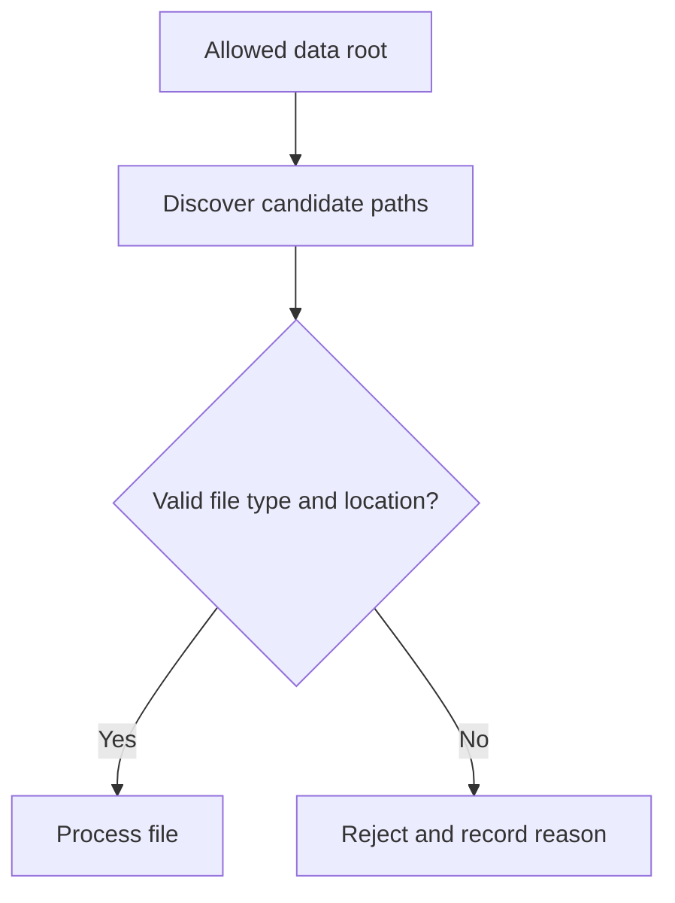

# Lesson 018 – File System and pathlib

## Learning Objectives

- Navigate, create, inspect, and safely traverse filesystem paths.
- Distinguish files, directories, relative paths, and absolute paths.
- Build portable data-discovery code with `pathlib`.

## Prerequisites

Complete Lessons 001–017, including File Handling.

## Why This Matters

File handling reads content; filesystem work finds, organizes, and protects that content. Data pipelines frequently discover uploads, create run folders, and reject unexpected file types. `pathlib` provides an object-oriented, cross-platform API that avoids fragile string concatenation.

## Theory

A `Path` can be relative to the current working directory or absolute from the filesystem root. `/` joins path components regardless of operating system. `exists()`, `is_file()`, and `is_dir()` inspect a path. `glob()` finds matching immediate children; `rglob()` searches recursively. Resolve a path before making a security decision, because `..` and symbolic links can change where it points.

## Mental Model

Treat a path as an address, not the data itself. First validate the address: does it exist, is it the intended kind, and is it inside an allowed root? Then read or write the content.

## Mermaid Diagram



## Core Concepts

| API | Purpose |
|---|---|
| `Path.cwd()` | current working directory |
| `path / "child"` | join components |
| `mkdir(parents=True)` | create nested folders |
| `glob("*.json")` | match direct children |
| `resolve()` | normalize to an absolute path |

## Multiple Practical Examples

```python
from pathlib import Path

project_root = Path.cwd()
data_dir = project_root / "data" / "incoming"
data_dir.mkdir(parents=True, exist_ok=True)
print(data_dir.resolve())
```

```python
from pathlib import Path

root = Path("datasets")
json_files = [path for path in root.glob("*.json") if path.is_file()]
for path in json_files:
    print(path.name, path.stat().st_size)
```

```python
from pathlib import Path

allowed_root = Path("uploads").resolve()
candidate = (allowed_root / "evaluation.json").resolve()

if allowed_root in candidate.parents and candidate.suffix == ".json":
    print(f"Safe candidate: {candidate.name}")
else:
    raise ValueError("path is outside uploads or has an unsupported suffix")
```

This containment check is useful for a controlled application boundary. It should be paired with authorization and careful handling of symbolic links in security-sensitive systems.

## Did You Know

`Path` objects are not automatically strings. Many APIs accept them directly; call `str(path)` only for an API that specifically requires text.

## Common Mistakes

- Using hard-coded path separators.
- Calling `rglob("*")` on a large untrusted tree without limits.
- Treating a suffix check as complete file-content validation.
- Deleting or overwriting a path without checking its exact resolved target.

## Best Practices

- Define an explicit project data root.
- Create output directories with `parents=True, exist_ok=True`.
- Filter candidates by file type and validate contents separately.
- Keep generated files away from source files and version control.

## Production Insight

Use immutable run directories such as `outputs/2026-07-29/run-123/`. Write a manifest containing input versions, configuration, and outputs. This makes a model result traceable without relying on whichever file happened to be newest.

## Interview Tip

Mention portability and safety: `pathlib` joins paths correctly, and `resolve()` plus an allowed-root check helps prevent path traversal at a user-controlled boundary.

## Real-World Example

A model-evaluation service scans only an approved dataset directory for `.jsonl` files, records their size and checksum, then writes reports to a separate run folder. It does not infer trust from the filename alone.

## Mini Exercises

1. Print your current working directory with `Path.cwd()`.
2. Create `artifacts/reports` without failing if it already exists.
3. List `.py` files in one folder without recursive search.

## Mini Project

Build `dataset_inventory.py`. Accept a data root, find direct `.csv` and `.json` files, and print name, extension, and byte size. Skip directories and unsupported files. Write a JSON inventory to a separate `reports` folder.

## Quiz

See [quiz.json](./quiz.json).

<details><summary>Quiz answers</summary>

1-B, 2-A, 3-C, 4-B, 5-A, 6-C, 7-B, 8-A, 9-C, 10-B.
</details>

## Interview Questions

### Beginner

What is the difference between a file and a directory path?

### Intermediate

Why is `Path("a") / "b"` preferable to manual separators?

### Advanced

How would you prevent user input from selecting files outside an approved upload root?

## Key Takeaways

- Paths identify filesystem locations; validate them before use.
- `pathlib` offers portable joins, inspection, matching, and creation.
- A suffix is a hint, not content validation.

## Flashcard Preview

- **Relative path:** resolved from the current working directory.
- **`glob`:** finds matching children.
- **`resolve`:** returns a normalized absolute path.

See [flashcards.json](./flashcards.json).

## Cheat Sheet

See [cheatsheet.md](./cheatsheet.md).

## Summary

`pathlib` makes filesystem work readable and portable. Validate location, type, and content at the boundary, and keep durable run artifacts separate from inputs.

## Next Lesson

Continue to [Lesson 019 – Virtual Environments and Packages](../019-virtual-environments-and-packages/).
