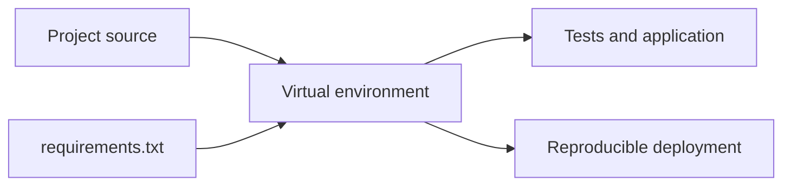

# Lesson 019 – Virtual Environments and Packages

## Learning Objectives

- Create and activate a project-specific virtual environment.
- Install, inspect, and record Python package dependencies.
- Make dependency setup reproducible for a team or deployment.

## Prerequisites

Complete Lessons 001–018 and have Python installed.

## Why This Matters

Different projects can require incompatible package versions. A virtual environment isolates one project's interpreter packages from another and from system tools. Reproducible environments prevent the “works on my machine” failure that is costly in data and AI projects.

## Theory

`venv` is Python's built-in environment tool. It creates a directory containing an interpreter and package location. After activation, `python` and `pip` normally point to that environment. `python -m pip` is safer than bare `pip` because it explicitly uses the selected interpreter. A requirements file records package versions; a lock file, when a project tool creates one, records a resolved dependency graph more exactly.

## Mental Model

Think of a virtual environment as a project tool shed. It contains the tools this project approved, without moving tools into other projects' sheds. The source code describes what to build; dependency files describe the required tools.

## Mermaid Diagram



## Core Concepts

| Command | Purpose |
|---|---|
| `python -m venv .venv` | create environment |
| `source .venv/bin/activate` | activate on macOS/Linux |
| `.venv\\Scripts\\Activate.ps1` | activate in PowerShell |
| `python -m pip install pkg` | install into selected interpreter |
| `python -m pip freeze` | inspect installed versions |

## Multiple Practical Examples

Create and activate an environment:

```bash
python3 -m venv .venv
source .venv/bin/activate
python -m pip install --upgrade pip
```

On Windows PowerShell, activate with `.venv\Scripts\Activate.ps1`. If a policy blocks it, follow your organization's approved PowerShell guidance rather than bypassing security controls.

Install an intentional dependency and verify its location:

```bash
python -m pip install requests==2.32.3
python -m pip show requests
python -c "import sys; print(sys.executable)"
```

Use a requirements file for a small project:

```text
requests==2.32.3
```

```bash
python -m pip install -r requirements.txt
python -m pip freeze > requirements-dev.txt
```

`freeze` is an observation of the active environment, not automatically the ideal production manifest. Review direct dependencies and use the dependency-management convention chosen by the project.

## Did You Know

Virtual environments do not containerize operating-system libraries, network access, or secrets. They isolate Python packages; Docker and deployment tooling solve different reproducibility problems.

## Common Mistakes

- Installing packages globally by accident.
- Activating one environment and running a different `pip`.
- Committing `.venv` itself instead of dependency specifications.
- Using unpinned latest versions for a deployed service.
- Installing an unreviewed package with a name similar to a trusted one.

## Best Practices

- Name the environment `.venv` and exclude it from version control.
- Use `python -m pip` and confirm `sys.executable` during setup.
- Pin production dependencies according to team policy.
- Upgrade dependencies deliberately, test them, and review security advisories.
- Keep secrets in environment-specific secret management, never in requirements files.

## Production Insight

Build CI from a clean environment, install only declared dependencies, then run tests. If CI needs a package that a developer's machine has globally but the project did not declare, the failure reveals a real reproducibility gap.

## Interview Tip

Differentiate isolation from reproducibility. A virtual environment isolates packages; a reviewed requirements or lock file helps another environment reproduce compatible versions.

## Real-World Example

An embedding service pins its SDK and HTTP client versions, builds a fresh environment in CI, runs integration tests against a test endpoint, and publishes the exact dependency manifest alongside the release.

## Mini Exercises

1. Create `.venv` in a practice folder and print `sys.executable` after activation.
2. Install one harmless package, inspect it with `pip show`, then uninstall it.
3. Create a requirements file with one pinned package and install it in a fresh environment.

## Mini Project

Create a `text-analysis` project with `.venv`, `requirements.txt`, and `verify_environment.py`. The script prints the interpreter path and imports a pinned package. Document setup commands in a README without committing `.venv` or credentials.

## Quiz

See [quiz.json](./quiz.json).

<details><summary>Quiz answers</summary>

1-A, 2-C, 3-B, 4-A, 5-C, 6-B, 7-A, 8-C, 9-B, 10-A.
</details>

## Interview Questions

### Beginner

Why use a virtual environment?

### Intermediate

Why prefer `python -m pip` to `pip`?

### Advanced

How would you prove that a production build uses only declared dependencies?

## Key Takeaways

- Virtual environments isolate project Python packages.
- `python -m pip` ties package commands to a chosen interpreter.
- Dependency files and clean CI builds create reproducibility.

## Flashcard Preview

- **`.venv`:** common project-local environment directory.
- **Pinned dependency:** a package version explicitly recorded.
- **Clean build:** setup that starts without machine-specific packages.

See [flashcards.json](./flashcards.json).

## Cheat Sheet

See [cheatsheet.md](./cheatsheet.md).

## Summary

Virtual environments prevent package conflicts, while explicit dependency specifications make projects reproducible. Treat installation as a tested part of the application, not a personal machine setup detail.

## Next Lesson

Continue to [Lesson 020 – Testing and Debugging](../020-testing-and-debugging/).
