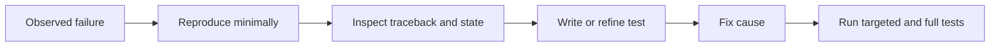

# Lesson 020 – Testing and Debugging

## Learning Objectives

- Write focused automated tests with `unittest`.
- Diagnose failures with assertions, tracebacks, logging, and a debugger.
- Test normal, boundary, and invalid behavior in data code.

## Prerequisites

Complete Lessons 001–019.

## Why This Matters

Code that runs once is not necessarily correct. Tests convert expected behavior into executable checks, making refactors safer. Debugging turns an observed failure into an evidence-backed fix. AI and data work needs both: a pipeline can complete while producing a subtly wrong metric or incorrectly filtered dataset.

## Theory

A unit test checks a small behavior in isolation. An assertion compares actual and expected results. Test a happy path, boundaries, and expected errors. `unittest` is included with Python and discovers classes derived from `unittest.TestCase`. A traceback identifies the failing call path; start at its final exception line, then inspect the relevant source location.

Logging records diagnostic events at levels such as `INFO`, `WARNING`, and `ERROR`. It is more controllable than temporary prints in long-running applications. A debugger pauses execution to inspect values; use it after you have a minimal reproducible failure.

## Mental Model

Tests are executable contracts. Debugging is an investigation: reproduce the symptom, form a hypothesis, inspect evidence, change one cause, and rerun the smallest relevant test.

## Mermaid Diagram



## Core Concepts

| Tool | Purpose |
|---|---|
| `assertEqual` | compare expected and actual values |
| `assertRaises` | verify an expected exception |
| `python -m unittest` | run standard-library tests |
| `logging` | configurable diagnostic records |
| `breakpoint()` | pause in an interactive debugger |

## Multiple Practical Examples

```python
def precision(true_positive, false_positive):
    denominator = true_positive + false_positive
    if denominator == 0:
        raise ValueError("precision is undefined without predicted positives")
    return true_positive / denominator
```

```python
import unittest


class PrecisionTests(unittest.TestCase):
    def test_precision(self):
        self.assertEqual(precision(8, 2), 0.8)

    def test_no_predictions_raises(self):
        with self.assertRaises(ValueError):
            precision(0, 0)


if __name__ == "__main__":
    unittest.main()
```

Save the function and test in the same file for this example, then run `python -m unittest test_metrics.py`. Production projects commonly keep tests in a separate `tests` directory.

```python
import logging

logging.basicConfig(level=logging.INFO, format="%(levelname)s %(message)s")
logging.info("Loaded %s evaluation records", 120)
logging.warning("Skipped %s records with missing labels", 3)
```

Log counts and safe identifiers, not raw customer text, tokens, or credentials.

## Did You Know

An assertion failure is valuable output. It proves a concrete expectation no longer holds; do not weaken a test merely to make a run green without understanding the intended behavior.

## Common Mistakes

- Testing only the successful path.
- Making tests depend on live APIs, time, randomness, or a developer's files.
- Testing implementation details instead of observable behavior.
- Changing several things before reproducing a bug.
- Leaving `breakpoint()` in a production path.

## Best Practices

- Keep tests deterministic and small.
- Name tests by behavior, such as `test_empty_batch_raises`.
- Use fixtures or temporary directories for file tests.
- Log structured, non-sensitive operational context.
- Run targeted tests while working and the full suite before delivery.

## Production Insight

Layer checks: unit tests for deterministic rules, integration tests for real boundaries, and monitoring for behavior after deployment. Model quality also needs data and evaluation tests, such as schema checks and threshold regression tests.

## Interview Tip

Describe a debugging sequence, not a vague claim. State how you reproduce, narrow the input, inspect the traceback and state, add a regression test, fix the cause, and run the suite.

## Real-World Example

A ranking-service test fixes a known query and candidate set, then asserts ordering and score bounds. A separate integration test checks the database adapter. Production metrics watch latency, error rate, and quality drift.

## Mini Exercises

1. Write a test for a function that normalizes whitespace.
2. Add an error-path test with `assertRaises`.
3. Replace a debug print with a useful `logging.info` call.

## Mini Project

Create `test_dataset_audit.py` for a dataset audit function. Test valid rows, blank required fields, an empty input, and an invalid score. Use a temporary directory for any file output and ensure the test does not depend on existing local files.

## Quiz

See [quiz.json](./quiz.json).

<details><summary>Quiz answers</summary>

1-C, 2-A, 3-B, 4-C, 5-A, 6-B, 7-C, 8-A, 9-B, 10-C.
</details>

## Interview Questions

### Beginner

What is the purpose of an automated test?

### Intermediate

What makes a test deterministic?

### Advanced

How would you test and monitor an ML data pipeline for both code failures and quality regressions?

## Key Takeaways

- Tests make expected behavior executable.
- Debugging starts with a minimal reproducible failure and evidence.
- Test boundaries and errors, not only happy paths.

## Flashcard Preview

- **Unit test:** isolated check of a small behavior.
- **Regression test:** prevents a fixed bug from returning.
- **Traceback:** call path and exception details for a failure.

See [flashcards.json](./flashcards.json).

## Cheat Sheet

See [cheatsheet.md](./cheatsheet.md).

## Summary

Testing and debugging create confidence through evidence. Make tests small and deterministic, use tracebacks and logs to investigate, and retain every discovered bug as a regression test.

## Next Lesson

Continue to [Lesson 021 – Python Best Practices](../021-python-best-practices/).
