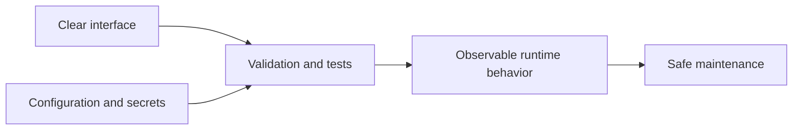

# Lesson 021 – Python Best Practices

## Learning Objectives

- Apply readable naming, structure, typing, and documentation conventions.
- Design code with safe boundaries, configuration, logging, and tests.
- Review Python changes for maintainability and operational risk.

## Prerequisites

Complete Lessons 001–020.

## Why This Matters

Production quality is the ability to change code safely after it works. Clear naming, small functions, explicit dependencies, tests, and observable failures let another engineer understand a system without rediscovering its assumptions. These practices matter especially in AI systems, where data and provider behavior can change outside the codebase.

## Theory

Python style emphasizes readability. Follow PEP 8 conventions: `snake_case` for functions and variables, `PascalCase` for classes, four-space indentation, and explicit imports. Type hints describe expected interfaces and help editors, reviewers, and static tools; they do not replace runtime validation at external boundaries.

Separate configuration from code. Read non-secret configuration from environment variables or approved configuration files; retrieve secrets from a secret manager. Keep functions focused, avoid hidden global state, and return clear values or raise clear exceptions.

## Mental Model

Treat each function as a small contract: its name states intent, inputs have known types and validation, output has predictable meaning, and failures are explicit. A codebase is a network of these contracts, supported by tests and documentation.

## Mermaid Diagram



## Core Concepts

| Practice | Outcome |
|---|---|
| Clear names | intent is visible |
| Type hints | interfaces are easier to review |
| Small functions | behavior is easier to test |
| Configuration separation | deploys vary without code edits |
| Logging and metrics | operations are observable |

## Multiple Practical Examples

```python
from collections.abc import Sequence


def average_score(scores: Sequence[float]) -> float:
    if not scores:
        raise ValueError("scores must not be empty")
    if any(not 0 <= score <= 1 for score in scores):
        raise ValueError("each score must be between 0 and 1")
    return sum(scores) / len(scores)


print(average_score([0.82, 0.91]))
```

The function name, type hints, validation, and error messages form a compact contract.

```python
import os


def required_environment(name: str) -> str:
    value = os.environ.get(name)
    if not value:
        raise RuntimeError(f"required environment variable is missing: {name}")
    return value
```

Do not print the returned value when it may be a secret. In production, use your platform's secret-management integration rather than committing a `.env` file.

```python
import logging

logger = logging.getLogger(__name__)


def process_batch(records: list[dict[str, str]]) -> int:
    valid_count = sum(1 for record in records if record.get("text", "").strip())
    logger.info("batch_processed total=%s valid=%s", len(records), valid_count)
    return valid_count
```

The log contains operational counts, not raw records. Configure handlers and levels in the application entry point, not inside every library module.

## Did You Know

`ruff`, `black`, `mypy`, and similar tools can automate formatting, linting, and type checking, but a passing tool run is not proof that a business rule is correct. Tests and code review still matter.

## Common Mistakes

- Using names like `data`, `temp`, or `x` for important values.
- Writing large functions that parse input, call APIs, write files, and format output together.
- Hard-coding URLs, model names, or secrets.
- Catching broad exceptions and continuing with an unsafe default.
- Logging personal data or credentials for debugging.

## Best Practices

- Make names precise and functions small.
- Add type hints at public boundaries and validate untrusted input.
- Keep dependencies pinned and environments reproducible.
- Format, lint, test, and review each change.
- Design for observability: safe logs, useful metrics, and actionable errors.

## Production Insight

Use a layered boundary: configuration selects an approved model and endpoint; validation checks request data; domain functions apply rules; adapters call external systems; logging and metrics record safe outcomes. This separation makes provider changes and incident response less risky.

## Interview Tip

When asked about code quality, describe concrete habits: clear interfaces, automated checks in CI, tests for behavior and failure paths, secure configuration, and observability. Avoid treating style as only formatting.

## Real-World Example

An AI document service validates upload metadata, stores originals separately from derived chunks, calls an injected embedding client, records a request ID and counts, and fails closed when required configuration is absent. Its tests use a fake client rather than a live paid API.

## Mini Exercises

1. Rename vague variables in an old script to include their purpose and unit.
2. Add type hints and validation to a function that computes a percentage.
3. Move a hard-coded endpoint into a required environment variable.

## Mini Project

Refactor a small script into `config.py`, `service.py`, and `main.py`. Add a typed pure function, validated configuration, safe logging, and unit tests. Document setup, required environment variables, and the command to run tests.

## Quiz

See [quiz.json](./quiz.json).

<details><summary>Quiz answers</summary>

1-B, 2-C, 3-A, 4-B, 5-C, 6-A, 7-B, 8-C, 9-A, 10-B.
</details>

## Interview Questions

### Beginner

Why are descriptive names useful?

### Intermediate

What do type hints provide, and what do they not provide?

### Advanced

How would you organize an AI service so configuration, domain logic, external adapters, and operational concerns remain maintainable?

## Key Takeaways

- Readable contracts, small functions, and validation make change safer.
- Type hints aid understanding but do not validate external input by themselves.
- Configuration, secrets, tests, and observability are production concerns.

## Flashcard Preview

- **Type hint:** documented expected interface.
- **Pure function:** output depends only on inputs and has no side effects.
- **Observability:** evidence needed to understand runtime behavior.

See [flashcards.json](./flashcards.json).

## Cheat Sheet

See [cheatsheet.md](./cheatsheet.md).

## Summary

Python best practices turn correct code into maintainable systems. Make intent visible, validate boundaries, isolate configuration and dependencies, and use automated checks and safe observability to support future change.

## Next Lesson

Continue to the next Python curriculum lesson when available.
