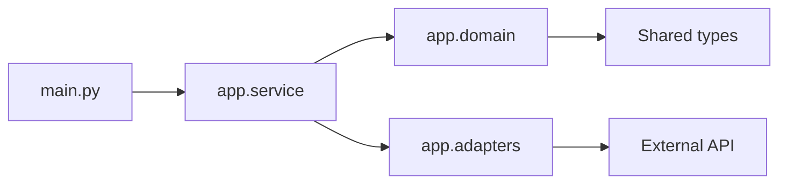

# Lesson 022 – Modules and Packages Advanced

## Learning Objectives

- Design clear module and package boundaries.
- Use absolute and relative imports without circular dependencies.
- Expose a deliberate package API for application code.

## Prerequisites

Complete Lessons 001–021, including Modules and Packages and Python Best Practices.

## Why This Matters

Modules keep related code together; packages keep related modules coherent as a project grows. A well-designed package makes dependencies visible and prevents a small script from becoming an untestable collection of imports. This is especially important when AI applications separate domain logic, provider adapters, configuration, and command entry points.

## Theory

A module is a `.py` file. A package is a directory of importable modules; modern Python can use namespace packages, though an `__init__.py` file is still useful when you want explicit package initialization or a public API. Prefer absolute imports from the package root in application code. Relative imports can be useful within a tightly coupled package but become harder to follow when overused.

An import executes a module once per process and stores it in `sys.modules`. Circular imports occur when two modules need each other during initialization. The usual fix is not an import trick: move shared types or functions to a lower-level module, or invert the dependency through an interface.

## Mental Model

Treat a package like a building. Public modules are entrances, internal modules are rooms, and dependency direction should flow inward toward stable domain concepts. If two rooms require each other to open, the layout needs redesign.

## Mermaid Diagram



## Core Concepts

| Concept | Purpose |
|---|---|
| Module | one importable `.py` file |
| Package | cohesive directory of modules |
| `__init__.py` | optional initialization and public exports |
| Absolute import | clear import from package root |
| Circular import | mutually dependent initialization to redesign |

## Practical Examples

```text
ai_app/
  __init__.py
  domain.py
  service.py
  adapters/
    __init__.py
    model_client.py
  main.py
```

```python
# ai_app/domain.py
from dataclasses import dataclass


@dataclass(frozen=True)
class Prompt:
    text: str
```

```python
# ai_app/service.py
from ai_app.domain import Prompt


def validate_prompt(prompt: Prompt) -> str:
    text = prompt.text.strip()
    if not text:
        raise ValueError("prompt text must not be blank")
    return text
```

```python
# ai_app/__init__.py
from ai_app.domain import Prompt

__all__ = ["Prompt"]
```

`__all__` documents a small intended public surface. It does not provide security; callers can still import internal modules. Keep package initialization lightweight—avoid network calls, configuration loading, or expensive work at import time.

## Did You Know

`if __name__ == "__main__":` keeps command-line startup code from running when a module is imported by tests or another module.

## Common Mistakes

- Naming files `json.py`, `typing.py`, or `email.py`, which can shadow standard-library modules.
- Executing business logic during import.
- Solving circular imports with delayed imports instead of improving boundaries.
- Exporting every internal helper as public API.

## Best Practices

- Organize by domain responsibility, not only file type.
- Keep imports at module top level unless a documented optional dependency requires otherwise.
- Make entry points thin: parse input, call services, report outcome.
- Add tests at public package boundaries.

## Production Insight

Package boundaries let you swap an LLM provider adapter while keeping prompt validation and evaluation rules independent. Inject the adapter into a service rather than importing a concrete client throughout domain code.

## Interview Tip

When explaining circular imports, identify the architectural cause: two modules know too much about each other. Describe extracting shared contracts or reversing a dependency rather than only moving an import line.

## Real-World Example

An ingestion package exposes `ingest_documents()` publicly. Internally it separates parsers, chunkers, storage adapters, and metrics. Tests use a fake storage adapter, while deployment config selects the real adapter.

## Mini Exercises

1. Split a script into `domain.py`, `service.py`, and `main.py`.
2. Add an `__all__` list for one intentional public class.
3. Identify two modules with circular imports and extract their shared type.

## Mini Project

Create an `evaluation` package with `metrics.py`, `models.py`, `service.py`, and `main.py`. Keep metric calculation independent of file I/O. Add a package-level export for the public evaluation result and tests that import it from the package root.

## Quiz

See [quiz.json](./quiz.json).

<details><summary>Quiz answers</summary>

1-A, 2-B, 3-C, 4-A, 5-B, 6-C, 7-A, 8-B, 9-C, 10-A.
</details>

## Interview Questions

### Beginner

What is the difference between a module and a package?

### Intermediate

What causes a circular import, and how would you fix it?

### Advanced

How would you package an AI service so external providers do not leak into domain logic?

## Key Takeaways

- Packages organize cohesive modules and make dependency direction visible.
- Keep imports and package initialization lightweight.
- Fix circular imports through better boundaries, not concealment.

## Flashcard Preview

- **Module:** an importable Python file.
- **Package:** a cohesive collection of modules.
- **Circular import:** mutually dependent module initialization.

See [flashcards.json](./flashcards.json).

## Cheat Sheet

See [cheatsheet.md](./cheatsheet.md).

## Summary

Advanced package design makes large Python systems navigable. Use clear public APIs, dependency direction, and thin entry points so features can evolve without import-related surprises.

## Next Lesson

Continue to [Lesson 023 – asyncio and Concurrency](../023-asyncio-and-concurrency/).
