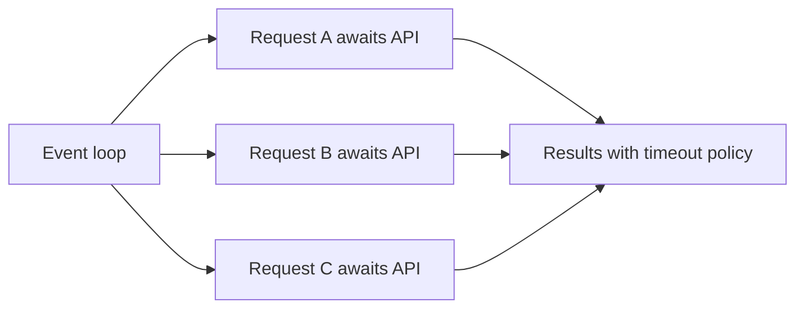

# Lesson 023 – asyncio and Concurrency

## Learning Objectives

- Explain concurrency, parallelism, coroutines, and the event loop.
- Run independent I/O-bound tasks with `asyncio` safely.
- Apply timeouts, cancellation, and concurrency limits to external calls.

## Prerequisites

Complete Lessons 001–022. You should understand functions, exceptions, packages, and iterators.

## Why This Matters

Applications often wait for networks, databases, files, or model APIs. Concurrency lets a program make progress on another independent task while one waits. `asyncio` is Python's standard framework for cooperative I/O concurrency. It is not a shortcut for CPU-heavy computation and must be paired with rate limits and error policy.

## Theory

A coroutine is a function declared with `async def`; calling it creates a coroutine object. `await` suspends the current coroutine until an awaitable result is ready, allowing the event loop to run another task. `asyncio.gather` coordinates several awaitables. A blocking operation such as `time.sleep()` stops the event loop; use an async library or move blocking work to an appropriate executor.

Concurrency overlaps waiting. Parallelism performs work simultaneously on multiple CPU cores. For CPU-bound tasks, consider process-based approaches after measurement; for network-bound calls, asyncio often improves throughput.

## Mental Model

The event loop is a coordinator. Each coroutine voluntarily yields at `await`, letting the coordinator advance another task. A blocking call is like one participant refusing to leave the microphone: everyone else waits.

## Mermaid Diagram



## Core Concepts

| Concept | Meaning |
|---|---|
| Coroutine | async function that can suspend |
| Event loop | schedules ready coroutines |
| `await` | yields while waiting for an awaitable |
| Task | scheduled coroutine execution |
| Semaphore | bounds simultaneous work |

## Practical Examples

```python
import asyncio


async def fetch_label(record_id: str) -> str:
    await asyncio.sleep(0.01)
    return f"label-for-{record_id}"


async def main() -> None:
    labels = await asyncio.gather(*(fetch_label(str(i)) for i in range(3)))
    print(labels)


asyncio.run(main())
```

```python
import asyncio


async def bounded_call(semaphore: asyncio.Semaphore, item: str) -> str:
    async with semaphore:
        await asyncio.sleep(0.01)
        return item.upper()


async def main() -> None:
    semaphore = asyncio.Semaphore(2)
    results = await asyncio.gather(*(bounded_call(semaphore, item) for item in ["a", "b", "c"]))
    print(results)


asyncio.run(main())
```

```python
import asyncio


async def slow_operation() -> str:
    await asyncio.sleep(1)
    return "done"


async def main() -> None:
    try:
        result = await asyncio.wait_for(slow_operation(), timeout=0.1)
    except TimeoutError:
        print("operation timed out")
    else:
        print(result)


asyncio.run(main())
```

## Did You Know

`asyncio.gather()` normally propagates an exception from one task. Choose error behavior intentionally; `return_exceptions=True` changes the result contract and requires callers to inspect results carefully.

## Common Mistakes

- Calling blocking functions inside `async def`.
- Creating unlimited concurrent API requests.
- Assuming async makes CPU-bound code faster.
- Swallowing task exceptions or cancellation.

## Best Practices

- Use async only around genuinely awaitable I/O.
- Set timeouts, retry policies, and bounded concurrency.
- Preserve task context in logs and handle cancellation cleanly.
- Test error and timeout paths, not only successful gathers.

## Production Insight

An LLM batch service should cap concurrent requests according to provider limits, use request timeouts, and classify retryable failures. Record each batch's attempted, succeeded, timed-out, and failed counts. More concurrency without these controls can create a faster outage.

## Interview Tip

State the I/O versus CPU distinction. Explain that `await` enables other coroutines while waiting; it does not make synchronous CPU computation nonblocking.

## Real-World Example

A document classifier sends bounded batches to a remote model API. Each request has a timeout and request ID; failures are retried only when transient, while invalid payloads are reported immediately.

## Mini Exercises

1. Write an async function that awaits `asyncio.sleep` and returns a value.
2. Run three coroutines with `gather`.
3. Add a semaphore limiting five tasks to two concurrent operations.

## Mini Project

Build `async_batch.py`. Accept record IDs, process them with a simulated async client, limit concurrency, and collect successes and failures. Add per-call timeout handling and print a final count summary. Keep retry decisions explicit.

## Quiz

See [quiz.json](./quiz.json).

<details><summary>Quiz answers</summary>

1-B, 2-A, 3-C, 4-B, 5-A, 6-C, 7-B, 8-A, 9-C, 10-B.
</details>

## Interview Questions

### Beginner

What does `await` do?

### Intermediate

Why should an async application limit concurrent network requests?

### Advanced

How would you make an async LLM batch client safe under provider rate limits and partial failures?

## Key Takeaways

- asyncio overlaps I/O waits through cooperative scheduling.
- Blocking calls and unlimited tasks undermine an event loop.
- Timeouts, limits, and clear failure policy are essential.

## Flashcard Preview

- **Coroutine:** async function execution that can suspend.
- **Event loop:** coordinator for ready async tasks.
- **Semaphore:** bound on simultaneous work.

See [flashcards.json](./flashcards.json).

## Cheat Sheet

See [cheatsheet.md](./cheatsheet.md).

## Summary

asyncio is valuable for independent I/O-bound work. Use it with bounded concurrency, timeouts, cancellation awareness, and operational measurements rather than treating it as automatic performance.

## Next Lesson

Continue to [Lesson 024 – Python Project Structure](../024-python-project-structure/).
