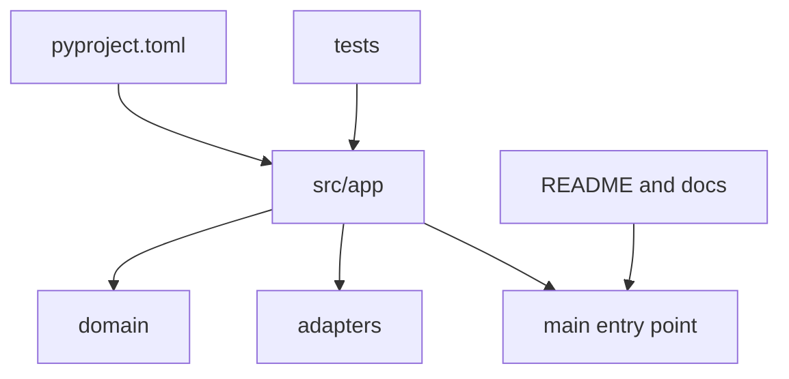

# Lesson 024 – Python Project Structure

## Learning Objectives

- Organize a Python application into source, tests, configuration, and tooling.
- Use a `src` layout and package entry points deliberately.
- Design a project that is testable, installable, and maintainable.

## Prerequisites

Complete Lessons 001–023.

## Why This Matters

Project structure communicates how an application is run, tested, configured, and extended. A predictable layout prevents source files, generated data, tests, and secrets from becoming mixed together. It also helps CI and new contributors use the same commands and import paths.

## Theory

A `src` layout places importable application packages below `src/`, while tests remain outside it. This reduces accidental imports from the repository root during development. `pyproject.toml` is the standard project configuration file for build tools and many developer tools. A `README` explains setup and usage; `.gitignore` excludes local environments, caches, and generated artifacts.

Structure should follow boundaries, not arbitrary layers. Keep pure domain rules independent of adapters for files, databases, APIs, or model providers. An entry point should construct dependencies and invoke the application; it should not contain the domain logic itself.

## Mental Model

Treat the repository as a small product: source is the engine, tests are the safety checks, configuration describes assembly, and documentation is the operating manual. Generated output belongs in a designated workspace, not among source modules.

## Mermaid Diagram



## Core Concepts

| Path | Responsibility |
|---|---|
| `src/package_name/` | importable application code |
| `tests/` | automated checks |
| `pyproject.toml` | build and tool configuration |
| `README.md` | setup and usage |
| `.gitignore` | excludes local/generated files |

## Practical Examples

```text
document_service/
  pyproject.toml
  README.md
  .gitignore
  src/document_service/
    __init__.py
    main.py
    domain.py
    service.py
    adapters/
      model_client.py
  tests/
    test_service.py
```

```python
# src/document_service/domain.py
from dataclasses import dataclass


@dataclass(frozen=True)
class Document:
    identifier: str
    text: str
```

```python
# src/document_service/service.py
from document_service.domain import Document


def document_length(document: Document) -> int:
    if not document.text.strip():
        raise ValueError("document text must not be blank")
    return len(document.text)
```

```python
# src/document_service/main.py
from document_service.domain import Document
from document_service.service import document_length


def main() -> None:
    document = Document("example", "A documented package is easier to maintain.")
    print(document_length(document))


if __name__ == "__main__":
    main()
```

## Did You Know

The `src` layout can expose tests that accidentally rely on the working directory. When tests import the installed package, they better match how users and deployments run it.

## Common Mistakes

- Putting secrets, virtual environments, and generated output under source control.
- Putting all logic in `main.py`.
- Letting tests import local files differently from the installed application.
- Creating many empty layers before a real responsibility exists.

## Best Practices

- Keep source, tests, docs, and generated artifacts separate.
- Put tool configuration in `pyproject.toml` where project conventions allow.
- Make application entry points thin and dependency construction explicit.
- Document setup, commands, required configuration, and supported Python version.

## Production Insight

For a deployed AI service, separate domain code from provider adapters and deployment settings. The same domain tests can run with a fake model client locally and a real configured client in an integration environment. Package structure makes these substitutions ordinary rather than invasive.

## Interview Tip

Describe structure in terms of change and testing. Explain how separating domain rules, adapters, and entry points lets you test core behavior without a database or model API.

## Real-World Example

A document-processing service stores its package under `src/`, uses tests with temporary directories and fake clients, reads deployment configuration from environment variables, and writes run outputs outside the package. Its CI installs the package before running tests.

## Mini Exercises

1. Move a script's logic from `main.py` into an imported service function.
2. Create a `tests` folder with one behavior-focused test.
3. Write `.gitignore` entries for `.venv`, `__pycache__`, and local output.

## Mini Project

Create a `prompt_evaluator` project using the shown layout. Add a domain model, a pure scoring service, a command-line entry point, and tests. Create a `pyproject.toml` with the supported Python requirement and document installation, test, and run commands.

## Quiz

See [quiz.json](./quiz.json).

<details><summary>Quiz answers</summary>

1-C, 2-B, 3-A, 4-C, 5-B, 6-A, 7-C, 8-B, 9-A, 10-C.
</details>

## Interview Questions

### Beginner

Why should tests be separate from application source?

### Intermediate

What problem can a `src` layout prevent?

### Advanced

How would you structure a Python AI service to support fake clients in tests and real adapters in production?

## Key Takeaways

- Project layout is an operational and maintenance decision.
- Separate source, tests, tools, documentation, and generated artifacts.
- Keep domain logic independent from adapters and entry points.

## Flashcard Preview

- **`src` layout:** application package lives below `src/`.
- **Entry point:** thin startup code that assembles dependencies.
- **Adapter:** boundary implementation for an external system.

See [flashcards.json](./flashcards.json).

## Cheat Sheet

See [cheatsheet.md](./cheatsheet.md).

## Summary

A clear project layout makes Python applications easier to install, test, deploy, and change. Use structure to express boundaries, keep runtime configuration outside core code, and make repeatable commands part of the project documentation.

## Next Lesson

Continue to the next Python curriculum lesson when available.
