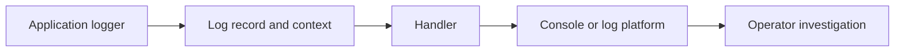

# Lesson 025 – Logging

## Learning Objectives

- Configure Python logging with useful levels and structured context.
- Choose between logs, metrics, exceptions, and prints.
- Design safe logs for production services and data pipelines.

## Prerequisites

Complete Lessons 001–024, especially Testing and Debugging and Python Best Practices.

## Why This Matters

Logs are evidence of what a system did. When a scheduled ingestion job fails at 2 a.m. or an AI request becomes slow, an operator needs safe context: what operation ran, which request it belonged to, what outcome occurred, and why. `print()` is useful during exploration; logging is configurable, routable, and suitable for applications.

## Core Concepts

Python's `logging` package sends records from a logger to handlers. A handler chooses a destination such as standard error or a file; a formatter controls representation. Levels communicate severity: `DEBUG` for detailed development diagnostics, `INFO` for normal lifecycle events, `WARNING` for unexpected recoverable conditions, `ERROR` for failed operations, and `CRITICAL` for severe service failure.

Library modules should create `logging.getLogger(__name__)` and emit records, while the application entry point configures handlers and levels. This keeps a reusable module from changing another application's logging policy.

## Mental Model

Think of each log record as a compact incident clue. It should answer which operation, which safe identifier, what outcome, and what duration or count. A log is not a data warehouse and must not become a copy of private prompts, credentials, or documents.

## Mermaid Diagram



## Core Concepts

| Concept | Purpose |
|---|---|
| Logger | creates named records |
| Level | communicates severity |
| Handler | sends records to a destination |
| Formatter | controls record representation |
| Exception logging | retains traceback with context |

## Syntax

```python
import logging

logger = logging.getLogger(__name__)
logger.debug("diagnostic detail")
logger.info("normal lifecycle event")
logger.warning("recoverable problem")
logger.error("operation failed")
```

The application configures logging once; modules obtain a named logger with
`getLogger(__name__)`. Use the logging methods with `%s` placeholders so a
disabled message does not need to be formatted.

## Executable Examples

```python
import logging

logging.basicConfig(
    level=logging.INFO,
    format="%(asctime)s %(levelname)s %(name)s %(message)s",
)
logger = logging.getLogger(__name__)

logger.info("ingestion_started dataset_id=%s", "dataset-2026-07")
logger.warning("row_skipped row_number=%s reason=%s", 18, "missing label")
```

Expected output includes an `INFO` record for the dataset and a `WARNING`
record for row 18. `basicConfig()` belongs in an executable entry point, not in
an imported library module.

```python
import logging

logger = logging.getLogger(__name__)


def load_score(raw_score: str) -> float:
    try:
        score = float(raw_score)
    except ValueError:
        logger.exception("score_parse_failed input_type=%s", type(raw_score).__name__)
        raise
    return score
```

`logger.exception` is appropriate inside an exception handler and includes the
traceback. Do not log the raw input if it might contain sensitive text.

```python
import logging
from time import perf_counter

logger = logging.getLogger(__name__)


def classify_batch(record_count: int) -> None:
    started = perf_counter()
    # Call application logic here.
    elapsed_ms = (perf_counter() - started) * 1000
    logger.info("batch_complete records=%s elapsed_ms=%.1f", record_count, elapsed_ms)


if __name__ == "__main__":
    logging.basicConfig(level=logging.INFO, format="%(levelname)s %(message)s")
    classify_batch(25)
```

This produces a single completion record with a record count and elapsed time.
It shows the useful shape of an operational event without exposing any record
contents.

## Real-World Example

A document-processing service gives every run a safe `run_id`. It logs
`document_started`, `document_completed`, and `document_failed` with document
IDs, chunk counts, duration, and outcome. When a document fails, an operator
can find its run and traceback without the logs containing the document itself.

## AI Engineering Relevance

For an LLM pipeline, log the provider, model alias, request ID, retry count,
safe token counts, latency, and outcome class. Keep prompt text, retrieved
documents, API keys, and user data out of logs. Use metrics for aggregate error
rate and latency percentiles; logs explain individual events.

## Did You Know

`basicConfig()` only configures logging if no handlers have already been configured in the process. Configure it once at the application boundary rather than repeatedly in imported modules.

## Common Mistakes

- Logging passwords, API keys, raw prompts, or personal data.
- Using `ERROR` for ordinary control flow or `DEBUG` for every event in production.
- Configuring root logging inside a reusable library.
- Catching an exception, logging it, and silently continuing when work is unsafe.

## Best Practices

- Log stable event names, safe IDs, counts, durations, and outcome reasons.
- Use consistent field names across a service.
- Keep logs separate from metrics: logs explain individual events; metrics aggregate trends.
- Attach request or run IDs at service boundaries.
- Test that sensitive fields are absent from log output.

## Mini Exercise

Write `process_scores(scores: list[str]) -> list[float]`. Configure logging at
`INFO`, log the number of input values and successfully parsed scores, and emit
a `WARNING` for each invalid value. Do not include the invalid value in the
warning. Then add an `ERROR` record with `logger.exception` for an unexpected
exception. Compare your events with the examples above: can an operator tell
what happened without seeing private data?

## Summary

- Logging records safe operational evidence.
- Levels, handlers, and formatters separate meaning, routing, and representation.
- Configure logging once at the application edge and avoid sensitive content.

## Next Lesson

Continue to [Lesson 026 – Configuration and Environment Variables](../026-configuration-and-environment-variables/).
