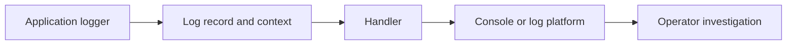

# Lesson 025 – Logging

## Learning Objectives

- Configure Python logging with useful levels and structured context.
- Choose between logs, metrics, exceptions, and prints.
- Design safe logs for production services and data pipelines.

## Prerequisites

Complete Lessons 001–024, especially Testing and Debugging and Python Best Practices.

## Why This Matters

Logs are evidence of what a system did. When a scheduled ingestion job fails at 2 a.m. or an AI request becomes slow, an operator needs safe context: what operation ran, which request it belonged to, what outcome occurred, and why. `print()` is useful during exploration; logging is configurable, routable, and suitable for applications.

## Theory

Python's `logging` package sends records from a logger to handlers. A handler chooses a destination such as standard error or a file; a formatter controls representation. Levels communicate severity: `DEBUG` for detailed development diagnostics, `INFO` for normal lifecycle events, `WARNING` for unexpected recoverable conditions, `ERROR` for failed operations, and `CRITICAL` for severe service failure.

Library modules should create `logging.getLogger(__name__)` and emit records, while the application entry point configures handlers and levels. This keeps a reusable module from changing another application's logging policy.

## Mental Model

Think of each log record as a compact incident clue. It should answer which operation, which safe identifier, what outcome, and what duration or count. A log is not a data warehouse and must not become a copy of private prompts, credentials, or documents.

## Mermaid Diagram



## Core Concepts

| Concept | Purpose |
|---|---|
| Logger | creates named records |
| Level | communicates severity |
| Handler | sends records to a destination |
| Formatter | controls record representation |
| Exception logging | retains traceback with context |

## Practical Examples

```python
import logging

logging.basicConfig(
    level=logging.INFO,
    format="%(asctime)s %(levelname)s %(name)s %(message)s",
)
logger = logging.getLogger(__name__)

logger.info("ingestion_started dataset_id=%s", "dataset-2026-07")
logger.warning("row_skipped row_number=%s reason=%s", 18, "missing label")
```

Use `%s` placeholders rather than eagerly building strings. Logging can avoid formatting a disabled lower-level message.

```python
import logging

logger = logging.getLogger(__name__)


def load_score(raw_score: str) -> float:
    try:
        score = float(raw_score)
    except ValueError:
        logger.exception("score_parse_failed input_type=%s", type(raw_score).__name__)
        raise
    return score
```

`logger.exception` is appropriate inside an exception handler and includes the traceback. Do not log the raw input if it might contain sensitive text.

```python
import logging
from time import perf_counter

logger = logging.getLogger(__name__)


def classify_batch(record_count: int) -> None:
    started = perf_counter()
    # Call application logic here.
    elapsed_ms = (perf_counter() - started) * 1000
    logger.info("batch_complete records=%s elapsed_ms=%.1f", record_count, elapsed_ms)
```

## Did You Know

`basicConfig()` only configures logging if no handlers have already been configured in the process. Configure it once at the application boundary rather than repeatedly in imported modules.

## Common Mistakes

- Logging passwords, API keys, raw prompts, or personal data.
- Using `ERROR` for ordinary control flow or `DEBUG` for every event in production.
- Configuring root logging inside a reusable library.
- Catching an exception, logging it, and silently continuing when work is unsafe.

## Best Practices

- Log stable event names, safe IDs, counts, durations, and outcome reasons.
- Use consistent field names across a service.
- Keep logs separate from metrics: logs explain individual events; metrics aggregate trends.
- Attach request or run IDs at service boundaries.
- Test that sensitive fields are absent from log output.

## Production Insight

For an LLM pipeline, record provider name, model alias, request ID, token counts when safe, latency, retry count, and outcome class. Avoid prompt text and secrets. Emit a metric for error rate and latency percentiles; logs alone are poor for alert thresholds.

## Interview Tip

Explain that logging is part of observability, not a replacement for error handling. State how you select level, add safe context, preserve tracebacks, and keep configuration at the application boundary.

## Real-World Example

A document processor logs `document_started`, `document_completed`, and `document_failed` with document IDs, chunk counts, and elapsed time. The original document content is stored only in its controlled data system, never copied into logs.

## Mini Exercises

1. Configure an `INFO` logger with timestamp, level, and message.
2. Replace a debugging `print` with a log record containing a safe record ID.
3. Log an exception with `logger.exception` inside an `except` block.

## Mini Project

Create `batch_logger.py`. Process a small list of records, log start and completion counts, log skipped invalid records at `WARNING`, and log unexpected exceptions with tracebacks. Add a run ID without logging the record text.

## Quiz

See [quiz.json](./quiz.json).

<details><summary>Quiz answers</summary>

1-B, 2-C, 3-A, 4-B, 5-C, 6-A, 7-B, 8-C, 9-A, 10-B.
</details>

## Interview Questions

### Beginner

What is the difference between `print()` and logging?

### Intermediate

When should you use `logger.exception`?

### Advanced

Which logs and metrics would you add to an AI batch-processing service?

## Key Takeaways

- Logging records safe operational evidence.
- Levels, handlers, and formatters separate meaning, routing, and representation.
- Configure logging once at the application edge and avoid sensitive content.

## Flashcard Preview

- **Logger:** creates log records.
- **Handler:** routes records to a destination.
- **`logger.exception`:** logs an active exception with traceback.

See [flashcards.json](./flashcards.json).

## Cheat Sheet

See [cheatsheet.md](./cheatsheet.md).

## Summary

Useful logging makes systems diagnosable without leaking data. Emit consistent, contextual records; complement them with metrics; and keep logging configuration out of reusable domain modules.

## Next Lesson

Continue to [Lesson 026 – Configuration and Environment Variables](../026-configuration-and-environment-variables/).
