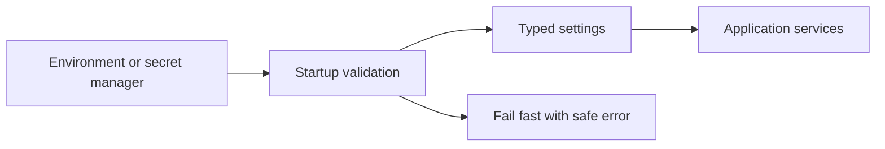

# Lesson 026 – Configuration and Environment Variables

## Learning Objectives

- Separate deploy-specific configuration from application code.
- Read, validate, and document environment variables safely.
- Distinguish non-secret settings from secrets and runtime state.

## Prerequisites

Complete Lessons 001–025.

## Why This Matters

The same application may use a local dataset during development, a test service in CI, and a production model endpoint after release. Hard-coded settings require code changes for every environment and make secrets easy to leak. Configuration lets deployment select approved values while code keeps stable behavior.

## Theory

Environment variables are string key-value pairs provided to a process. `os.environ` raises `KeyError` for a missing value; `os.getenv` can return `None` or a default. Convert and validate values at startup so invalid configuration fails early with an actionable message. Do not let arbitrary environment strings flow directly into security-sensitive or billing-sensitive operations.

Secrets are credentials or keys; they need access controls and should come from approved secret management in production. Non-secret configuration can include log level, timeouts, model aliases, or feature flags. Neither belongs in source code or logs.

## Mental Model

Configuration is an input boundary just like an API request. Parse it once, validate it, convert it into a typed application settings object, then pass that object to components. This avoids every module reading globals and interpreting strings differently.

## Mermaid Diagram



## Core Concepts

| Concept | Use |
|---|---|
| Environment variable | deploy-specific string input |
| Secret | sensitive credential with restricted access |
| Default | safe optional fallback value |
| Required setting | startup failure if absent |
| Typed settings | validated configuration object |

## Practical Examples

```python
import os


def required_setting(name: str) -> str:
    value = os.getenv(name)
    if not value:
        raise RuntimeError(f"missing required setting: {name}")
    return value


model_name = required_setting("MODEL_NAME")
```

```python
import os


def positive_int_setting(name: str, default: int) -> int:
    raw_value = os.getenv(name, str(default))
    try:
        value = int(raw_value)
    except ValueError as error:
        raise RuntimeError(f"{name} must be an integer") from error
    if value < 1:
        raise RuntimeError(f"{name} must be positive")
    return value


timeout_seconds = positive_int_setting("REQUEST_TIMEOUT_SECONDS", 30)
```

```python
from dataclasses import dataclass
import os


@dataclass(frozen=True)
class Settings:
    model_name: str
    timeout_seconds: int


def load_settings() -> Settings:
    return Settings(
        model_name=os.environ["MODEL_NAME"],
        timeout_seconds=int(os.getenv("REQUEST_TIMEOUT_SECONDS", "30")),
    )
```

In production, add validation before constructing `Settings`; this concise example shows one central loading point.

## Did You Know

Changing an environment variable in a shell affects only processes started afterward. A running service usually needs restart or a deliberate configuration reload mechanism.

## Common Mistakes

- Committing `.env` files with real credentials.
- Treating every setting as optional and running with unsafe defaults.
- Logging complete settings objects when they include secrets.
- Reading and converting the same variable in many modules.

## Best Practices

- Maintain a documented list of required, optional, and secret settings.
- Validate type, range, and allowed values at startup.
- Use safe defaults only for genuinely optional behavior.
- Provide `.env.example` without values when local tooling needs a template.
- Rotate compromised credentials and remove them from history through approved incident processes.

## Production Insight

An AI service should allow an approved model alias and bounded timeout, not arbitrary model and endpoint values supplied by every request. Secret retrieval should be audited and scoped to the service identity. Emit configuration version or non-secret feature flags in deployment metadata, not secret values.

## Interview Tip

Separate configuration from secrets in your answer. Explain that both are externalized, but secrets receive stronger access control, are never logged, and must be rotated when exposed.

## Real-World Example

A classifier service loads `MODEL_ALIAS`, `REQUEST_TIMEOUT_SECONDS`, and a secret API credential at startup. CI supplies test values; production injects them through its deployment platform. The service refuses to start if a required model alias is unknown.

## Mini Exercises

1. Read a required `APP_ENV` setting and produce a clear error if absent.
2. Convert an optional port variable to a positive integer.
3. Create a frozen `Settings` dataclass with two validated values.

## Mini Project

Build `settings.py` for a batch processor. Load required input path and model alias, optional positive concurrency and timeout values, and a secret token. Add validation, a safe `describe()` method that excludes the token, and tests for missing and invalid settings.

## Quiz

See [quiz.json](./quiz.json).

<details><summary>Quiz answers</summary>

1-C, 2-A, 3-B, 4-C, 5-A, 6-B, 7-C, 8-A, 9-B, 10-C.
</details>

## Interview Questions

### Beginner

Why use environment variables?

### Intermediate

Why should configuration be validated at startup?

### Advanced

How would you manage secrets and non-secret settings across local, CI, and production environments?

## Key Takeaways

- Configuration is an external input that requires validation.
- Centralized typed settings prevent inconsistent interpretation.
- Secrets need stricter controls and must not enter logs or source control.

## Flashcard Preview

- **Environment variable:** process-provided string setting.
- **Fail fast:** reject invalid startup configuration early.
- **Secret:** sensitive credential requiring restricted handling.

See [flashcards.json](./flashcards.json).

## Cheat Sheet

See [cheatsheet.md](./cheatsheet.md).

## Summary

External configuration enables safe environment-specific deployment. Load it centrally, validate it early, make safe defaults explicit, and treat credentials as secrets rather than ordinary strings.

## Next Lesson

Continue to [Lesson 027 – Command-Line Interfaces](../027-command-line-interfaces/).
