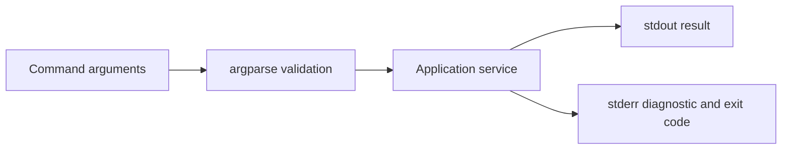

# Lesson 027 – Command-Line Interfaces

## Learning Objectives

- Build a safe command-line interface with `argparse`.
- Validate arguments and return meaningful exit codes.
- Design commands suitable for automation and production operations.

## Prerequisites

Complete Lessons 001–026.

## Why This Matters

A command-line interface (CLI) turns Python code into a repeatable tool. Analysts, CI systems, schedulers, and operators can run the same command with explicit inputs instead of editing source code. A good CLI provides help, validates inputs, writes predictable output, and signals success or failure with an exit code.

## Theory

`argparse` is Python's standard library for command-line arguments. A parser defines positional arguments, options, defaults, choices, and help text. `parse_args()` converts command text into a namespace. Keep parsing at the outer edge: convert arguments into typed values, call importable application functions, then return an integer exit status.

Standard output is for useful normal results; standard error is for diagnostics. Exit code `0` conventionally means success; nonzero values signal failure. This contract lets shell scripts and schedulers detect a failed job without parsing a human sentence.

## Mental Model

A CLI is an API for people and automation. Its flags are inputs, its output is a response, its exit code is status, and its help text is documentation. Design it as carefully as a web endpoint.

## Mermaid Diagram



## Core Concepts

| Concept | Purpose |
|---|---|
| Positional argument | required command input |
| Option | named optional or required flag |
| `choices` | restrict values to allowed options |
| Exit code | machine-readable success/failure |
| `--help` | generated command documentation |

## Practical Examples

```python
import argparse


def build_parser() -> argparse.ArgumentParser:
    parser = argparse.ArgumentParser(description="Summarize evaluation scores")
    parser.add_argument("--input", required=True, help="Path to evaluation JSON")
    parser.add_argument("--format", choices=["text", "json"], default="text")
    return parser


args = build_parser().parse_args(["--input", "scores.json", "--format", "json"])
print(args.input, args.format)
```

```python
import argparse
from pathlib import Path


def existing_file(value: str) -> Path:
    path = Path(value)
    if not path.is_file():
        raise argparse.ArgumentTypeError(f"not a file: {path}")
    return path
```

Using a custom argument type gives a clear validation error before application work begins.

```python
import sys


def main() -> int:
    try:
        # Parse arguments and call a service here.
        print("evaluation completed")
    except ValueError as error:
        print(f"invalid input: {error}", file=sys.stderr)
        return 2
    return 0


if __name__ == "__main__":
    raise SystemExit(main())
```

## Did You Know

`argparse` automatically supplies `-h` and `--help` unless help is disabled. Help text is part of your command's public interface, so describe units, defaults, and required input clearly.

## Common Mistakes

- Parsing arguments deep inside domain functions.
- Using flags for secrets that will be visible in shell history or process listings.
- Printing human diagnostics to standard output when automation expects machine-readable output.
- Returning success after a failed operation.

## Best Practices

- Keep `main()` thin and call importable tested services.
- Validate paths, ranges, and choices at the command boundary.
- Provide `--help`, clear examples, and stable exit-code meaning.
- Use `--dry-run` for potentially destructive commands.
- Send secrets through approved environment or secret mechanisms, not command flags.

## Production Insight

A nightly evaluation CLI should accept an input manifest and output path, validate both, log a run ID, and exit nonzero on invalid data or failed publishing. Its output format should be documented so a scheduler can distinguish a report from a diagnostic.

## Interview Tip

Mention CLI contracts: validated arguments, concise help, stdout versus stderr, and nonzero exit codes. These details show that you design tools for automation, not only interactive use.

## Real-World Example

An ML evaluation command accepts `--dataset`, `--model-alias`, and `--output`. It restricts aliases to approved choices, validates the dataset file, writes a versioned report, and returns code `2` for user input errors.

## Mini Exercises

1. Create a parser with one required positional name.
2. Add an integer option with a positive-value validator.
3. Return a nonzero exit code for an invalid file path.

## Mini Project

Build `evaluate.py` with `--input`, `--output`, `--threshold`, and `--format` options. Validate file paths and threshold range, write a summary, support `--dry-run`, and return distinct exit codes for invalid arguments and processing errors.

## Quiz

See [quiz.json](./quiz.json).

<details><summary>Quiz answers</summary>

1-A, 2-B, 3-C, 4-A, 5-B, 6-C, 7-A, 8-B, 9-C, 10-A.
</details>

## Interview Questions

### Beginner

What does `argparse` do?

### Intermediate

Why should a CLI return nonzero after a failed operation?

### Advanced

How would you make a destructive operational CLI safe for CI and human operators?

## Key Takeaways

- A CLI is a stable contract for people and automation.
- Parse and validate at the boundary; keep domain functions importable.
- Use clear help, output channels, and exit codes.

## Flashcard Preview

- **Positional argument:** required command input.
- **Exit code:** machine-readable outcome status.
- **`--dry-run`:** preview without applying changes.

See [flashcards.json](./flashcards.json).

## Cheat Sheet

See [cheatsheet.md](./cheatsheet.md).

## Summary

Well-designed CLIs make Python applications repeatable and automatable. Use `argparse`, boundary validation, predictable outputs, and honest exit codes so commands work reliably in both a terminal and a scheduler.

## Next Lesson

Continue to the next Python curriculum lesson when available.
